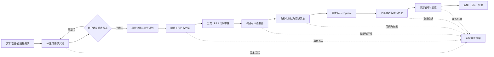

# AI 开发测试发布流水线平台：初始产品发现与功能脑暴

> 日期：2026-09-18  
> 阶段：初始产品发现  
> 适用场景：云游戏 SDK，覆盖 Android、iOS、Windows、macOS、Web 的长期愿景

## 0. 结论先行

这个产品不应被定义成“给普通用户一个聊天框，让 AI 一句话改代码并直接发版”，而应被定义成：

> **面向云游戏 SDK 的可信变更工厂：业务人员用自然语言提出需求，平台把需求编译成受控代码变更，生成可体验产物，并用可追溯的测试、审批和发布证据证明这次变更可信。**

真正的产品壁垒不在“AI 会不会写代码”。现有工具已经分别覆盖 AI 生成 PR、CI/CD、Web 预览、移动应用分发、真机测试和测试管理。值得建设的差异化是：

1. 把非研发人员的自然语言需求转成可确认、可验收、可追溯的“需求契约”。
2. 把 AI 变更限制在受控仓库、目录、风险级别和隔离环境内。
3. 把一个需求下的代码、跨平台产物、测试证据、审批和发布记录串成统一证据链。
4. 让自动化用例持续复用、自动重跑，从而减少人工重复测试；只有满足严格条件时，才复用历史测试结果。
5. 通过风险分级决定自动化程度，而不是让 AI 同时拥有“定义正确、证明正确、批准上线”三种权力。

### 首版建议

用 6–10 周验证一条窄而完整的闭环：

- 只选一个 Android SDK Demo 或集成示例应用。
- 只开放 3 类低风险需求。
- AI 只能创建分支和 PR，不能直接合并主干或发布生产。
- 每次变更生成内部测试 APK、自动化测试结果和“可信变更包”。
- 测试计划及结果同步到 MeterSphere，原始执行证据保留在流水线平台。
- 由产品确认业务结果、代码负责人审批变更后，才进入内部测试发布。

首版先证明“可信闭环成立”，再扩展 Web、iOS、Windows、macOS 和正式发布。

## 1. 产品机会

### 1.1 目标用户

首批目标用户不是完全不了解 SDK 的泛化“普通用户”，而是内部懂业务但不直接改代码的人：

- SDK 产品经理
- 业务经理、解决方案经理、售前或客户交付人员
- SDK 技术支持
- 测试负责人
- 作为审批者的 SDK 研发和模块负责人

当平台在低风险场景中证明可靠后，再逐步扩大到更广泛的业务用户。

### 1.2 用户要完成的任务

当用户发现一个小问题或希望调整一个已有能力时，他希望：

1. 不需要先学会写技术需求或搭建开发环境。
2. 能用文字、语音、截图或录屏说明期望结果。
3. 快速拿到可安装或可在线体验的真实产物，而不只是代码片段。
4. 清楚看到改了什么、没改什么、测试了什么、还有什么风险。
5. 确认结果后推动内部发布，失败时能安全交给研发或恢复上一版本。
6. 未来发生问题时，能反查需求、代码、产物、测试、审批和发布的完整记录。

### 1.3 当前痛点

- 需求从业务语言到技术实现之间需要多轮转述，简单需求也要排研发队列。
- 五个平台的仓库、构建方式、产物和测试入口分散，业务人员很难独立验收。
- AI 生成代码的速度提高了，但“是否改对、是否测全、谁批准、发布的是不是测试过的那一份”仍缺少可信答案。
- 自动化测试、MeterSphere、CI/CD、制品库和发布系统各有记录，但没有围绕一次变更形成统一关联。
- 测试团队会重复执行已经稳定自动化的检查，同时又担心错误复用历史结果造成漏测。

### 1.4 核心待验证假设

1. 高频小需求中有足够比例可以被模板化为低风险变更。
2. 非研发人员能够确认结构化验收标准，并能通过真实产物判断结果是否符合预期。
3. AI 生成的低风险变更能让研发在较短时间内完成审查，而不是把编码时间转化为更高的审查成本。
4. 质量团队愿意接受有明确指纹、有效期和失效条件的自动化测试凭证。
5. 当前代码库、构建脚本和测试用例具备建立标准化流水线的最低基础。

## 2. 产品原则

### 2.1 “一句话”是入口，不是发布权限

合理流程是：

`口述需求 → 结构化需求契约 → 用户确认 → AI 修改 → 构建与测试 → 人工审批 → 内部发布`

自然语言可以降低输入门槛，但不能跳过需求确认、风险判断和发布责任。

### 2.2 可信来自可核验事实，不来自日志数量

证据链必须回答：

- 谁提出、为何修改？
- AI 理解成了什么，用户确认了什么？
- 改了哪些仓库、文件和接口？
- 哪个提交生成了哪个制品？
- 在什么环境，用哪个版本的用例测了什么？
- 哪些结果被复用，为什么仍然有效？
- 谁基于哪些证据批准？
- 发布到哪里，失败后如何恢复？

日志、截图和视频是证据材料，不等于结论本身。界面应先展示决策摘要，再允许下钻原始证据。

### 2.3 测试的是哪个发布候选，发布的就必须是同一个发布候选

构建产物必须用摘要锁定，但要区分“构建主体”和“最终分发制品”：签名、公证或重新打包会改变文件字节和摘要。平台需要记录父子制品谱系，例如 `UnsignedPayloadDigest → SigningAttestation → SignedArtifactDigest`。正式门禁必须验证最终签名后的发布候选；通过测试和审批后，晋级的是同一个 `SignedArtifactDigest`，不能再重新构建或重新签名一个内容可能不同的包。

Android MVP 从一开始就生成内部测试签名 APK，并对这份最终 APK 测试和审批。未来切换正式签名时，要把正式签名包视为新的发布候选，完成必要验证后才能发布。

### 2.4 AI 不能自己出题、自己判卷、自己批准上线

AI 可以：

- 整理需求、发现不确定项
- 提议修改计划和测试计划
- 在隔离环境中修改代码
- 生成候选测试用例和失败分析
- 根据既定策略执行低风险步骤

AI 不应在首期：

- 自己确认需求理解正确
- 只用自己新生成的测试证明自己改对了
- 绕过代码负责人批准
- 接触正式签名私钥或生产凭据
- 自主完成生产发布

### 2.5 平台负责串联，不急于替代所有现有系统

- GitHub/GitLab 继续承担代码、分支、PR 和评审事实。
- 现有 CI Runner 继续承担构建和基础测试执行。
- MeterSphere 继续承担用例、计划和测试管理视图。
- 制品库继续保存 APK、IPA、安装包和 SDK 包。
- 本平台承担需求契约、编排、风险策略、关联 ID、原始证据、审批门禁和统一体验。

## 3. 目标用户旅程



## 4. 三个视角的功能创意

### 4.1 产品经理视角：5 个创意

#### P1. 对话式“需求编译器”

把文字、语音、截图和录屏整理为版本化需求契约，至少包含：现状、期望、目标平台、影响用户、验收标准、反例、不在本次范围、风险和回滚条件。AI 只追问最关键的 1–3 个问题，用户确认后才能进入开发。

- 核心价值：降低表达门槛，并在改代码前暴露理解偏差。
- MVP：文本/语音输入，单项目，固定需求模板。
- 关键假设：用户虽然不会实现，但能判断结果和验收标准。
- 主要风险：AI 用流畅措辞掩盖“脑补”；必须显式标出不确定项，并保留原始输入映射。

#### P2. 受控 AI 变更工作台

AI 在隔离环境中完成代码定位、计划、修改、静态检查、自测和 PR 创建；全过程展示影响文件、依赖变化、命令、结果和权限使用。

- 核心价值：让 AI 真正承担实现工作，同时保留工程控制权。
- MVP：一个允许名单仓库和目录，AI 只创建 PR。
- 关键假设：低风险需求可由现有代码模式和仓库说明可靠约束。
- 主要风险：跨模块影响遗漏、敏感信息泄漏、看似合理但语义错误的代码。

#### P3. 多平台产物与即时体验中心

在同一需求页面展示各平台状态、在线预览、二维码、安装包、版本、提交摘要和有效期；允许按平台分别验收。

- 核心价值：业务用户直接体验真实结果，不必阅读代码或进入多个 CI 页面。
- MVP：Android 内测 APK；云端 Android 预览可作为增强项。
- 关键假设：标准 Demo/集成示例应用能呈现足够多的 SDK 变更。
- 主要风险：Demo 通过不等于客户应用兼容；在线预览不能替代真实设备上的音视频、输入和弱网体验。

#### P4. 变更感知的测试凭证

从验收标准、代码差异、依赖图和历史缺陷中选择测试集，并为执行或复用结果生成可解释凭证。

- 核心价值：减少人工重复执行，同时让 QA 知道为什么可以不重测、何时必须重测。
- MVP：稳定的单元、接口和 Android UI 冒烟用例；先保留固定回归基线，再逐步引入智能选测。
- 关键假设：代码模块与测试用例能建立可靠映射。
- 主要风险：影响分析错误导致漏测；不稳定用例污染门禁可信度。

#### P5. 发布闸门与 AI 变更档案

把需求版本、PR、提交、产物、测试、审批、发布和恢复串成不可混淆的档案，并按风险动态设置门禁。

- 核心价值：任何版本都能回答“为什么改、测了什么、谁批准、如何恢复”。
- MVP：只发布到内部测试渠道，生产仍走既有流程。
- 关键假设：各系统能提供稳定唯一 ID，并愿意把审批结果写回平台。
- 主要风险：流程过重导致团队绕开平台；记录很多但没有形成可决策结论。

### 4.2 产品设计视角：5 个创意

#### D1. 可执行需求卡

把自然语言实时整理成六张卡：现状问题、期望结果、目标用户、目标平台、验收标准、不在本次范围。模糊项用醒目状态展示，可直接编辑，不要求用户重写技术文档。

- 体验目标：让非研发用户在 5 分钟内完成一次低风险需求确认。
- MVP 验证：20 个真实历史需求，统计首次可执行率、追问次数和理解偏差返工率。

#### D2. “变更体验舱”

默认展示业务语言版变更摘要、修改前后截图、验收步骤和可体验产物；代码差异作为下钻信息。后续扩展为五端状态矩阵，允许“批准 Android、退回 Web”。

- 体验目标：用户不求助研发即可安装、体验、圈选问题并提交返修。
- 关键约束：每个页面醒目标注环境、构建号、提交哈希、产物摘要和有效期，不能只写“最新版本”。

#### D3. 可信证据时间线与“测试护照”

用一条时间线串联需求、代码、构建、测试、MeterSphere、审批和发布；每个制品附带测试护照，说明覆盖范围、环境、未覆盖项和失效条件。

- 体验目标：未参与开发的人能在 5–10 分钟内还原一次变更全貌。
- 关键约束：展示 AI 的决策摘要和引用证据，不展示无法独立核验的内部推理过程。

#### D4. 风险自适应审批收件箱

审批人看到的是一张决策卡：变更范围、用户影响、测试结论、证据缺口、剩余风险和建议动作。支持批准、退回、要求技术复核和按平台部分批准。

- 体验目标：把审批焦点从“翻日志”变成“基于证据作决定”。
- 关键约束：代码、测试或产物摘要一旦变化，旧审批自动失效。

#### D5. 失败恢复台

失败时先说明：哪里失败、影响哪些平台、哪些结果仍有效、AI 已尝试什么。提供有边界的操作：从检查点重试、只重建失败平台、转人工、恢复上一稳定入口。

- 体验目标：非研发用户能判断下一步，不因一个失败从头重跑所有步骤。
- 关键约束：自动修复超出原需求契约时必须重新确认，并设置最大尝试次数和修改范围预算。

### 4.3 软件工程视角：5 个创意

#### E1. 多仓库、多平台产品线蓝图

用版本化清单描述五端仓库、组件、负责人、依赖、兼容矩阵、构建模板和发布渠道。一个逻辑 `ChangeSet` 可以关联多个仓库、PR 和产物。

- MVP：登记一个 Android 仓库、一个 Demo 应用和一个固定分支。
- 远期价值：支持跨仓库影响分析与跨平台版本集合。
- 风险：隐式依赖和特殊构建脚本难以一次性标准化。

#### E2. 隔离式 AI 开发工作区

每个需求创建短生命周期环境，限制文件、网络、计算和凭据权限。AI 先计划后修改，不能写保护分支；仓库内容、Issue 和文档都按不可信输入处理。

- MVP：目录白名单、行数/文件数/依赖变更预算、网络白名单、PR-only。
- 远期价值：多 Agent、多仓库协调和按风险动态授权。
- 风险：提示词注入、非确定性、恶意依赖和跨平台 Runner 隔离。

#### E3. 多平台构建、签名与预览工厂

统一编排 Linux、Windows、macOS Runner，并把编译与签名分离。AI 和普通 Runner 不接触私钥，只能提交签名请求。

- Android：APK/AAB、二维码、模拟器或真机。
- Web：临时预览 URL。
- Windows：安装包与远程体验环境。
- macOS：签名、公证后的 DMG/PKG。
- iOS：IPA、Ad Hoc、企业分发或 TestFlight。

MVP 只做内部测试签名 Android APK；Web 作为第二平台。iOS/macOS 的签名、公证、设备与审核流程放到后续。编译主体与签名后制品分别计算摘要，通过签名证明建立父子关系；最终分发制品必须经过对应门禁。

#### E4. 测试证据账本与 MeterSphere 适配器

显式关联验收标准、用例版本、执行环境、日志、截图、视频、性能指标、覆盖记录和失败重试。MeterSphere 负责测试管理投影，平台保留不可变执行事实和大体量原始证据。

- MVP：测试计划和结果单向同步到 MeterSphere，并读回核验关键字段。
- 工程要求：幂等键、外部 ID 映射、重试、限流、失败补偿、死信队列和对账任务。
- 风险：MeterSphere 版本和认证差异、两套事实源冲突、附件体量和敏感数据泄漏。

#### E5. 策略即代码的发布门禁与恢复

把需求确认、代码审查、兼容检查、安全扫描、测试覆盖、签名和人工审批配置成版本化策略。每次判定都保存当时使用的规则、输入、输出和例外原因。

- MVP：产品验收 + 代码负责人审批 + 测试门禁 + 内部发布审批。
- 远期价值：灰度、Feature Flag、运行时健康门禁和预定义恢复动作。
- 风险：SDK 已被客户集成后通常无法真正召回；“恢复”可能只是停止分发、恢复推荐版本或发布修复版。

## 5. 跨视角优先级：Top 5

评分为 1–5 分；总分重点考虑核心价值、验证速度和差异化潜力。

| 优先级 | 能力 | 核心价值 | 验证速度 | 差异化 | 总分 | 首期判断 |
|---|---|---:|---:|---:|---:|---|
| 1 | 需求编译器与需求契约 | 5 | 5 | 4 | 14 | 必须先验证，否则后续自动化建立在误解上 |
| 2 | 受控 AI 变更工作台 | 5 | 4 | 4 | 13 | 证明 AI 能进入真实仓库但不越权 |
| 3 | 测试证据账本与测试护照 | 5 | 3 | 5 | 13 | 直接支撑“可信”和“减少重复测试” |
| 4 | Android 可安装产物与体验舱 | 4 | 4 | 4 | 12 | 让业务用户验收真实结果，而非代码 |
| 5 | 风险门禁与可信变更档案 | 5 | 3 | 4 | 12 | 让 AI 变更能进入生产治理体系 |

### 5.1 需求编译器与需求契约

**为什么优先：** 最大风险不是 AI 不会写，而是 AI 对一个模糊需求写出了“看起来合理”的错误实现。需求契约是代码、测试、验收和发布的共同基线。

**MVP：** 文字/语音输入；固定字段；显示不确定项；用户确认后生成版本；任何范围变化重新确认。

**要验证的假设：**

- 至少 70%–80% 的候选小需求能在一次研发补充内形成可执行契约。
- 用户能独立确认验收标准，而不是只确认一段听起来正确的总结。
- 需求确认耗时比当前流程明显下降，且理解偏差返工不增加。

### 5.2 受控 AI 变更工作台

**为什么优先：** 它直接验证 AI 是否能安全进入真实开发过程，而不是只生成无法落库的示例代码。

**MVP：** 一个仓库、一个固定分支基线、目录白名单、隔离工作区、计划先行、PR-only、模块负责人审批。

**要验证的假设：**

- 至少 70% 的低风险 PR 能进入正常评审，而不需要研发推倒重写。
- 中位审查与修正时间低于 30 分钟。
- 不发生越权文件修改、凭据访问或未声明依赖变更。

### 5.3 测试证据账本与测试护照

**为什么优先：** 它是产品区别于普通 AI 编码工具和普通 CI 面板的核心，也是减少测试工作量的前提。

**MVP：** 固定回归基线、用例版本、环境指纹、APK 摘要、日志/截图/视频链接、MeterSphere 结果同步与回读。

**要验证的假设：**

- QA 能仅凭测试护照判断覆盖了什么、为什么通过、什么没有覆盖。
- 在植入已知回归的历史变更回放中不发生漏检。
- 首批 20–30 个样本中，严重漏检为 0，“流水线绿但人工发现阻断问题”不超过 1 次；人工重复执行工时下降至少 30%。这些是试点门槛，不代表具有统计稳定性的长期比例。

### 5.4 Android 可安装产物与体验舱

**为什么优先：** 真实 APK 能同时验证构建能力和非研发验收体验，比只展示代码或日志更接近用户价值；同时比 Apple 平台更适合快速试点。

**MVP：** 内部测试签名 APK、二维码/限时下载、安装说明、变更前后证据、版本/提交/摘要展示；可选接入云端 Android 设备。

**要验证的假设：**

- 用户无需研发协助即可安装并按验收步骤完成验证。
- 受支持需求能在 30 分钟内产出首个 APK。
- Demo/示例应用足以呈现首批低风险需求的真实效果。

### 5.5 风险门禁与可信变更档案

**为什么优先：** 没有审批责任和版本绑定，再详细的日志也无法让 AI 变更安全进入生产流程。

**MVP：** 低/中/高三级风险；产品、研发、测试、发布四类角色；证据缺失时不可批准；产物变化后旧审批失效；只发布内部渠道。

**要验证的假设：**

- 历史需求回放的风险分级与团队实际判断基本一致。
- 非参与者能在 5–10 分钟内还原一次变更全貌。
- 门禁没有显著增加低风险需求的总周期，团队不会绕过平台。

## 6. 建议的 6–10 周 MVP

### 6.1 MVP 用户与范围

这一步是**流程可行性验证**：证明需求转译、受控改码、构建、测试、证据和审批可以形成闭环。它不能单独证明 AI 已经安全进入 SDK 核心代码或客户生产环境。只有阶段 2 在一个真实、受控的 Android SDK 模块完成灰度并满足质量门槛后，才可以开始使用“生产就绪”或“进入生产”的表述。

#### 参与者

- 3–5 名产品、业务、解决方案或测试人员
- 1–2 名 Android SDK 研发/代码负责人
- 1 名测试负责人
- 1 名内部发布负责人

#### 只支持

- 一个 Android SDK Demo/集成示例仓库
- 一个固定开发分支或主干基线
- 一个 SDK 版本
- 一个内部测试环境
- 内部测试签名 APK
- 一组稳定的单元、接口和 Android UI 冒烟用例
- 一套 MeterSphere 项目/测试计划映射

#### 只开放 3 类需求

1. Demo 层文案、布局、图片、配置和功能开关。
2. 已有 SDK API 的调用参数、初始化流程和集成胶水代码调整。
3. 有稳定复现步骤、明确预期结果和现有测试环境的小型缺陷。

#### 明确不做

- 一个需求同时修改 Android、iOS、Windows、macOS、Web。
- SDK 核心协议、公共 API/ABI、底层音视频链路变更。
- 登录、鉴权、计费、安全、隐私、加密和数据迁移相关变更。
- 大规模重构、主要依赖升级、开放式性能优化。
- 无法稳定复现的缺陷。
- 任意仓库、任意路径的自由修改。
- 正式证书签名、应用商店提交或无人审批的生产发布。
- AI 生成测试后，由 AI 单独判定覆盖充分。
- 自建一套完整测试管理系统替代 MeterSphere。
- 全机型、全系统版本兼容性测试。

### 6.2 黄金路径

1. 用户在网页用文字或语音提交低风险需求。
2. AI 生成需求契约、验收标准、不变范围和风险等级。
3. 用户确认；缺少关键事实时只能继续澄清，不能直接执行。
4. AI 在隔离工作区生成修改计划并改代码。
5. 平台创建分支和 PR，运行静态检查和已有测试。
6. 流水线构建内部测试 APK，生成二维码或限时下载链接。
7. 运行单元、接口和模拟器/UI 冒烟测试，采集环境、日志、截图和视频。
8. 将测试计划、用例关联和执行结果同步到 MeterSphere，并读回核验。
9. 产品验收实际 APK，代码负责人审批 PR，测试门禁确认完整性。
10. 同一 APK 晋级到内部发布入口，自动生成可信变更档案和发布说明。
11. 失败时可从检查点重试、转人工，或恢复上一稳定分发入口。

### 6.3 周期建议

| 周期 | 目标 |
|---|---|
| 第 1–2 周 | 选择仓库与历史样本；定义需求类型、目录白名单、风险规则、证据模型和成功指标 |
| 第 3–4 周 | 打通需求契约、人工确认、隔离工作区、分支/PR 和差异审查 |
| 第 5–6 周 | 打通 APK 构建、产物下载、单元/接口/UI 冒烟测试和环境指纹 |
| 第 7–8 周 | 完成审批门禁、可信变更包、MeterSphere 同步/回读和内部发布记录 |
| 第 9–10 周 | 回放历史需求；试运行 20–30 个真实低风险需求；评估是否扩展第二平台 |

## 7. “减少重复测试”的正确产品定义

目标应写成：

> **自动化用例可以持续复用并由流水线自动重跑，从而免去人工重复执行；历史测试结果只有在执行指纹满足策略时才可复用。**

不能把“一次通过”理解成未来永久有效。一个结果至少绑定：

```text
相同制品摘要
+ 相同测试用例版本
+ 相同平台、设备和系统版本
+ 相同构建参数、配置与功能开关
+ 相同依赖和 SDK 版本
+ 相同或策略允许的数据基线
+ 仍在有效期内
= 才可复用历史测试结论
```

如果任一项变化，应重新执行相关自动化用例，或由有权限的人基于明确理由做例外审批。

### 测试选择的三层结构

1. **固定基线：** 每次必跑的编译、单元、接口契约、安全和核心冒烟测试。
2. **变更感知集：** 根据影响模块、调用关系、历史缺陷和平台选择的增量用例。
3. **人工/专项验证：** 主观画质、音视频同步、输入手感、复杂弱网、真机兼容和高风险业务语义。

AI 可以建议第 2、3 层，但不能静默删除固定基线。

## 8. MeterSphere 集成边界

### 8.1 事实源分工

- **MeterSphere：** 测试用例、测试计划、执行管理、团队可见状态和测试报告入口。
- **流水线平台：** 实际运行事件、环境指纹、产物摘要、原始日志、截图、视频、性能数据、同步状态和不可变关联。
- **Git 平台：** 代码、提交、PR、评审和分支保护事实。
- **制品库：** 二进制及其摘要、签名和保留策略。

MeterSphere 不应成为全部大体量原始证据的唯一存储；平台可以把摘要、状态和受权限保护的证据链接同步过去。

### 8.2 建议同步字段

- 平台运行 ID、需求契约版本、ChangeSet ID
- Git 仓库、分支、提交哈希、PR/MR 链接
- SDK 版本、APK 版本、产物摘要、下载/证据链接
- 测试计划、用例 ID、用例版本、步骤结果
- 执行环境、设备、OS、构建参数、配置和数据基线
- 开始/结束时间、执行人/执行器、重试次数
- 通过、失败、阻塞、跳过、复用等状态及明确原因
- 日志、截图、视频、性能结果和失败分类的链接
- 审批状态、发布时间和发布渠道

### 8.3 集成工程要求

- 使用平台 ID 与 MeterSphere ID 映射，所有写入带幂等键。
- 同步失败不丢失本地事实，通过重试、死信队列和人工补偿恢复。
- 写入后读回关键字段对账，不能仅凭 HTTP 成功码判断业务成功。
- 版本、认证、工作空间和项目上下文由独立适配器封装。
- 使用最小权限服务身份；测试和生产项目分离。
- 明确读写边界，先做只读验证，再逐步开放计划、结果和附件写入。
- 适配器版本化，避免平台业务模型直接绑定某个 MeterSphere 版本的接口结构。

## 9. 可信变更包与核心数据模型

### 9.1 最小关联链

```text
Requirement
  → RequirementVersion
  → AcceptanceCriterion
  → RiskAssessment
  → ChangeSet
  → CodeRevision / PullRequest
  → BuildRun
  → Artifact + ArtifactDigest
  → TestPlan + TestCaseVersion
  → TestExecution + ExecutionFingerprint
  → Evidence
  → GateEvaluation + Approval
  → Release + DistributionChannel
  → RuntimeObservation / RollbackExecution
```

### 9.2 每次变更至少保存

- 原始需求及附件、结构化需求契约、确认人和版本差异
- AI 模型/代理版本、策略版本、执行计划、使用的代码上下文引用
- 工具调用、命令、退出码、修改文件、代码差异和依赖变化
- 构建 Runner 镜像/系统、工具链版本、参数、日志和耗时
- 产物名称、摘要、SBOM、签名状态和保留期限
- 用例版本、环境指纹、步骤结果、失败重试、截图/视频/性能数据
- MeterSphere 映射、同步尝试、回读结果和对账异常
- 每个门禁的规则版本、输入、判定、例外理由和审批人
- 发布渠道、时间、版本、监控链接、停止分发或恢复记录

### 9.3 不应保存或应脱敏

- 大模型不可核验的内部思维过程
- 明文密钥、Token、签名私钥和用户密码
- 未经授权的客户数据、账号、聊天内容和设备隐私数据
- 可以通过安全引用获取的大体量重复内容

## 10. 风险分级与权限边界

| 级别 | 典型变更 | AI 权限 | 必需审批 |
|---|---|---|---|
| R0 | 只读分析、影响评估、生成计划 | 可自动执行 | 无写入；用户确认后进入下一步 |
| R1 | Demo 文案、布局、图片、受限配置、已有开关 | 可改白名单目录并创建 PR | 产品验收 + 代码负责人 |
| R2 | 单平台 SDK 行为、已有 API 调用与小型缺陷 | 可提议和实现，扩大测试集 | 模块负责人 + QA |
| R3 | 公共 API/ABI、协议、鉴权、计费、隐私、音视频核心链路 | 只做分析和草案 | 架构/安全/专项测试/负责人 |
| R4 | 正式签名、商店提交、生产发布、不可逆迁移 | 不接触关键凭据，不自主执行 | 发布责任人，必要时双人审批 |

强制规则：修改范围、代码提交、用例版本或产物摘要变化后，与旧内容绑定的验收和审批自动失效。

## 11. 指标与验证实验

### 11.1 MVP 主指标与长期北极星

MVP 主指标采用 **“可审查可信候选产出率”**：

> 进入支持范围且验收标准已确认的需求中，平台在约定的系统执行时间内生成可安装 APK、通过必选测试、形成完整证据包并进入“等待代码负责人审批”状态的比例。

系统执行时间单独统计，不混入用户澄清、人工排队和审批等待；同时分别记录需求确认耗时、研发审查耗时和总交付周期。

当样本规模和真实发布次数足够后，再使用长期北极星 **“24 小时可信交付率”**：在 24 小时内完成可安装产物、必选测试、完整证据和代码负责人批准的支持范围需求占比。它同时约束速度、可用成果和可信度，避免只统计 AI 写了多少代码。

### 11.2 护栏指标

- 首批样本中 P0/P1 逃逸缺陷：0；一旦发生即停止扩展。
- 首批 20–30 个样本中，流水线通过但人工发现阻断问题：不超过 1 次，并逐例复盘。
- 需求—代码—构建—测试—审批—产物关联缺失：0 次。
- 越权目录修改、密钥泄露、绕过审批发布：0 次。
- 对至少 20 次相同提交重复构建，失败不超过 1 次；失败必须可解释。
- MeterSphere 允许瞬时重试，但最终未同步或未对账成功：0 次；首试成功率仅作观察指标。
- 人工重复回归工时：相比基线减少至少 30%，作为方向性结果而非统计定论。
- 研发实际审查与修正时间中位数：低于 30 分钟/需求，不包含排队等待。
- Demo 阶段记录验收后发现的缺陷，但不把“发布后 14 天逃逸率”作为生产质量结论。

### 11.3 五个最小验证实验

1. **需求理解实验：** 用 20 个历史小需求，让 5 名非研发用户重新描述；研发盲评需求契约是否可执行。
2. **影子改码实验：** AI 完成 10 个历史需求但不合并；比较 AI PR 与真实历史改动，统计可接受率、遗漏和审查成本。
3. **证据还原实验：** 让未参与者仅凭可信变更包，在 5–10 分钟内回答改了什么、测了什么、谁批准、发布了什么。
4. **漏测对抗实验：** 向历史变更植入已知回归，检查固定基线和智能选测是否都能发现；在此之前不能启用免人工门禁。
5. **失败恢复实验：** 人为注入编译失败、测试失败和 MeterSphere 同步失败，观察非研发用户能否判断影响范围并正确转人工或重试。

首批 20 个真实需求中，若少于 12 个能形成可审查可信候选、少于 14 个经有限修改后获得研发批准，或出现任何严重逃逸缺陷，就不应立即扩展第二个平台。这些门槛用于试点决策，不代表长期统计结论。

## 12. 分阶段路线图

### 阶段 0：历史回放与影子运行

不改真实流程，用历史需求建立需求契约、AI PR、测试凭证和风险判定，校准规则和证据模型。

### 阶段 1：Android Demo 单平台可信闭环

实现自然语言需求、受控改码、APK、自动测试、MeterSphere 同步、人工审批和内部发布。

### 阶段 2：进入受控 Android SDK 模块

增加 API 兼容检查、安全扫描、制品溯源、真机测试和少量 SDK 低风险目录；仍不自动发布生产。

### 阶段 3：增加 Web 或业务量最高的第二平台

建立统一需求模型、公共 API 契约测试和平台差异矩阵，再验证一个需求如何拆成多个平台子任务。

### 阶段 4：扩展 Windows、iOS 和 macOS 工程能力

分别建设专用 Runner、签名、公证、设备测试和分发门禁。各平台有独立准入规则，不追求表面上的完全统一模板。

### 阶段 5：内部自助与风险分级自动化

R1 低风险变更可在完整门禁后自动晋级到测试分支；R2 需要研发/QA；R3/R4 继续走专项流程。

### 阶段 6：多平台发布编排

在单平台流水线都达到可信阈值后，才支持一次需求生成多平台变更、统一发布计划、灰度、监控和恢复。正式发布始终由策略和责任人共同控制。

## 13. 当前市场边界与差异化

当前产品已经分别覆盖流水线中的若干环节：

| 现有能力 | 已解决的问题 | 本产品不应重复造的轮子 | 仍存在的机会 |
|---|---|---|---|
| GitHub/GitLab AI Agent | 从 Issue/提示生成代码和 PR，支持异步迭代 | 通用 AI 编码与 PR 协作 | 云游戏 SDK 领域契约、跨平台产物、测试凭证和发布责任链 |
| Vercel Preview | 分支/提交生成可分享的 Web 预览 | 通用 Web 临时环境 | 原生应用产物、五端状态和同一需求下的统一验收 |
| Firebase App Distribution / TestFlight | iOS/Android 预发布分发和测试反馈 | 移动应用分发与测试者管理 | 将分发产物绑定需求、代码、自动化测试和审批证据 |
| BrowserStack 等设备云 | 真机执行、日志/视频、并行矩阵和测试自动化 | 大规模设备资源与成熟执行框架 | 变更感知选测、组织内用例治理和发布门禁 |
| MeterSphere | 用例、计划、接口/功能/性能测试管理与报告 | 完整测试管理 UI | 需求到代码、制品、原始证据和发布的跨系统关联 |
| Artifact Attestation / SBOM | 构建来源与供应链证明 | 标准化制品来源证明 | 把来源证明纳入业务需求、测试和审批决策 |

其中，**GitLab 是最接近“一体化平台”的参照物**：Duo Agent Platform、CI/CD、多项目流水线、测试报告、Release Evidence 和审计能力已经能够组合出目标流程的一大部分。GitHub Copilot/第三方 Coding Agents + Actions + Attestations，再组合 Vercel、Firebase、BrowserStack 和 MeterSphere，也能搭出相似链路。因此，如果本产品只是给现有工具再包一层聊天框和流水线页面，最终很可能退化为一次内部集成项目。

因此，差异化定位应是：

> **不是另一个 AI 编码器、CI 系统或测试管理工具，而是面向多平台云游戏 SDK 的“变更控制面 + 证据平面”。**

AI 编码模型应可替换；Git、CI、MeterSphere、制品库和设备云应通过适配器接入。平台长期积累的资产应是需求契约、风险策略、产品线蓝图、测试映射、证据模型和历史变更知识，而不是对某个单一模型的绑定。

参考资料：

- [GitHub Copilot Cloud Agent：从任务到 PR](https://docs.github.com/en/copilot/how-tos/use-copilot-agents/cloud-agent/use-cloud-agent-on-github)
- [GitHub：第三方 Coding Agents](https://docs.github.com/en/copilot/concepts/agents/about-third-party-coding-agents)
- [GitLab Duo Agent Platform](https://docs.gitlab.com/user/duo_agent_platform/)
- [GitLab Developer Flow](https://docs.gitlab.com/user/duo_agent_platform/flows/foundational_flows/developer/)
- [GitLab Release Evidence](https://docs.gitlab.com/user/project/releases/release_evidence/)
- [Vercel Preview Deployments](https://vercel.com/academy/svelte-on-vercel/preview-deployments)
- [Firebase App Distribution](https://firebase.google.com/docs/app-distribution)
- [Apple TestFlight](https://developer.apple.com/testflight/)
- [BrowserStack App Automate](https://www.browserstack.com/docs/app-automate/appium/overview)
- [BrowserStack Test Companion](https://www.browserstack.com/docs/test-companion/test-lifecycle/automate-tests)
- [MeterSphere 测试计划](https://metersphere.io/docs/v3.x/user_manual/test_plan/test_plan/)
- [GitHub Artifact Attestations](https://docs.github.com/en/actions/how-tos/secure-your-work/use-artifact-attestations/use-artifact-attestations)

## 14. 下一步需要形成的 5 个明确决策

这些问题不阻塞本轮创意收敛，但在进入 PRD 和技术方案前必须明确：

1. **首个试点仓库：** 是否采用一个 Android SDK Demo/集成示例应用；当前构建、测试和分支保护是否稳定。
2. **首批需求白名单：** 从过去 3 个月需求中选出哪 20–30 个低风险样本。
3. **现有工具底座：** 当前 Git 平台、CI、制品库、内部分发、设备/模拟器资源和 SSO 分别是什么。
4. **MeterSphere 接入：** 目标版本、项目/工作空间、可用认证方式、允许写入的对象和专用服务身份。
5. **责任边界：** 产品、研发、QA、发布负责人分别批准什么；生产发布与签名私钥由哪个现有系统继续掌管。

建议下一份产物不是立刻画全量技术架构，而是先输出一份针对 Android 单平台试点的 PRD，包含用户故事、需求契约字段、风险分级、黄金路径、异常路径、证据字段、MeterSphere 映射和验收指标。随后再按这份 PRD 做技术架构与实施拆解。
