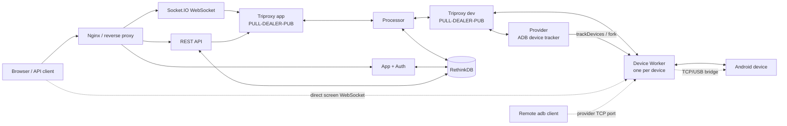

# DeviceFarmer/STF 当前架构研究

> 研究时间：2026-09-29  
> 基线：官方仓库 `DeviceFarmer/stf` 的 `master`，提交 [`3224bbe`](https://github.com/DeviceFarmer/stf/commit/3224bbe8b5c6f70287c52932a159add9fa9d9f12)（2026-09-28）；`package.json` 版本为 `3.8.0`，许可证为 Apache-2.0。本文源码链接均固定到该提交。  
> 范围：只使用 STF 官方仓库、README、部署文档和仓库内源码；没有对实际生产集群抓包或压测。

## 一、结论先行

STF 不是一个单体 Web 应用，而是一组可独立部署的 **unit（进程）**：浏览器入口、认证、REST API、Socket.IO 控制面、设备 Provider、每设备 Worker、RethinkDB、存储插件等，通过两套 ZeroMQ 总线连接。官方部署文档明确说明 unit 之间使用 ZeroMQ 和 Protocol Buffers 通信。[官方部署文档](https://github.com/DeviceFarmer/stf/blob/3224bbe8b5c6f70287c52932a159add9fa9d9f12/doc/DEPLOYMENT.md#L1-L11)

最关键的架构分界是：

- **控制与状态面**：浏览器 Socket.IO / REST API → app-side ZeroMQ → Processor → device-side ZeroMQ → Device Worker；RethinkDB保存用户、Token、设备当前状态、占用关系和 Group/预约等元数据。[Triproxy](https://github.com/DeviceFarmer/stf/blob/3224bbe8b5c6f70287c52932a159add9fa9d9f12/lib/units/triproxy/index.ts#L25-L46) [Processor](https://github.com/DeviceFarmer/stf/blob/3224bbe8b5c6f70287c52932a159add9fa9d9f12/lib/units/processor/index.ts#L44-L79) [数据库表](https://github.com/DeviceFarmer/stf/blob/3224bbe8b5c6f70287c52932a159add9fa9d9f12/lib/db/tables.ts#L8-L84)
- **画面数据面**：浏览器直接连接对应 Device Worker 的独立 WebSocket 端口；Worker 从 minicap 取帧并把二进制帧发给浏览器。画面帧**不经过**中央 Socket.IO、ZeroMQ、Processor 或 RethinkDB。[Worker 画面服务器](https://github.com/DeviceFarmer/stf/blob/3224bbe8b5c6f70287c52932a159add9fa9d9f12/lib/units/device/plugins/screen/stream.ts#L503-L528) [帧广播](https://github.com/DeviceFarmer/stf/blob/3224bbe8b5c6f70287c52932a159add9fa9d9f12/lib/units/device/plugins/screen/stream.ts#L568-L665) [浏览器画面客户端](https://github.com/DeviceFarmer/stf/blob/3224bbe8b5c6f70287c52932a159add9fa9d9f12/res/app/src/features/control/screen/screen-stream.ts#L60-L84)
- **远程 ADB 数据面**：ADB 客户端连接 Provider 主机上由该 Device Worker 打开的 TCP 端口，再由 adbkit 的 TCP/USB bridge 接到物理设备；它不是 SSH/VPN，也不经过 WebSocket。[ADB bridge](https://github.com/DeviceFarmer/stf/blob/3224bbe8b5c6f70287c52932a159add9fa9d9f12/lib/units/device/plugins/connect.ts#L120-L218)

## 二、组件与职责

| 组件 / 进程 | 当前职责 | 关键边界与官方依据 |
|---|---|---|
| Nginx / 外部反向代理 | 把 App、Auth、REST API、Socket.IO、Storage 统一到用户入口；生产示例还可把设备侧端口映射到 URL。 | 官方把它定义为 Proxy role。[部署角色](https://github.com/DeviceFarmer/stf/blob/3224bbe8b5c6f70287c52932a159add9fa9d9f12/doc/DEPLOYMENT.md#L67-L70)；仓库 Compose 将 7100 暴露给外部。[Compose](https://github.com/DeviceFarmer/stf/blob/3224bbe8b5c6f70287c52932a159add9fa9d9f12/docker-compose.yaml#L163-L189) |
| `app` | 主 HTTP 服务，提供 Web UI 静态资源和页面壳；当前 UI 是 React + TypeScript 路由应用。 | [App unit 定义](https://github.com/DeviceFarmer/stf/blob/3224bbe8b5c6f70287c52932a159add9fa9d9f12/doc/DEPLOYMENT.md#L183-L217) [React 入口](https://github.com/DeviceFarmer/stf/blob/3224bbe8b5c6f70287c52932a159add9fa9d9f12/res/app/src/entries/app.tsx#L1-L60) |
| `auth-*` | 登录入口；官方提供 mock、OAuth2、LDAP、SAML 等 unit。 | mock 只信任姓名/邮箱，不适合不可信用户。[认证部署说明](https://github.com/DeviceFarmer/stf/blob/3224bbe8b5c6f70287c52932a159add9fa9d9f12/doc/DEPLOYMENT.md#L222-L305) |
| `api` | Swagger/Express REST 控制面：设备列表、占用/释放、remoteConnect 等；通过 ZeroMQ 向设备发命令并等待事件/事务回复。 | 占用使用设备锁并等待 `JoinGroupMessage`，超时 5 秒。[占用 API](https://github.com/DeviceFarmer/stf/blob/3224bbe8b5c6f70287c52932a159add9fa9d9f12/lib/units/api/controllers/user.ts#L128-L205) |
| `websocket` | 浏览器实时控制网关（Socket.IO）：把触控、按键、Group 等事件编码为 protobuf 后送入 app 总线；把设备状态和事务结果推回浏览器。 | 每连接订阅全局频道和用户私有 Group。[订阅](https://github.com/DeviceFarmer/stf/blob/3224bbe8b5c6f70287c52932a159add9fa9d9f12/lib/units/websocket/index.ts#L525-L537) [触控编码](https://github.com/DeviceFarmer/stf/blob/3224bbe8b5c6f70287c52932a159add9fa9d9f12/lib/units/websocket/index.ts#L682-L737) |
| `triproxy-app` / `triproxy-dev` | 两侧各一座 ZeroMQ 桥：PULL 接收本侧 PUSH，DEALER 与 Processor 交换，PUB 向本侧 SUB 广播。 | 源码只有转发逻辑，本身不执行业务和持久化。[Triproxy 源码](https://github.com/DeviceFarmer/stf/blob/3224bbe8b5c6f70287c52932a159add9fa9d9f12/lib/units/triproxy/index.ts#L25-L46) |
| `processor` | 跨越 app/dev 两侧的桥与状态同步器；设备事件写入 RethinkDB后再广播到 app 侧。 | app → dev 直接转发；dev → app 按消息类型更新状态。[总线连接](https://github.com/DeviceFarmer/stf/blob/3224bbe8b5c6f70287c52932a159add9fa9d9f12/lib/units/processor/index.ts#L44-L79) [状态处理](https://github.com/DeviceFarmer/stf/blob/3224bbe8b5c6f70287c52932a159add9fa9d9f12/lib/units/processor/index.ts#L336-L390) |
| RethinkDB | 控制面数据库：`users`、`accessTokens`、`vncauth`、`devices`、`logs`、`groups`；存当前状态、权限身份、占用和 Group 数据。 | 它不是画面帧仓库，也不是 ZeroMQ 的替代品。[表与索引](https://github.com/DeviceFarmer/stf/blob/3224bbe8b5c6f70287c52932a159add9fa9d9f12/lib/db/tables.ts#L8-L84)；Processor 会等数据库连通再处理，避免未落库消息丢失。[连接保护](https://github.com/DeviceFarmer/stf/blob/3224bbe8b5c6f70287c52932a159add9fa9d9f12/lib/db/index.ts#L115-L128) |
| `groups-engine` | Group/设备分区、预约调度与配额相关的后台引擎；同时接 app/dev 两套总线。 | Compose 显示其同时连接两侧 PUSH/SUB。[Compose](https://github.com/DeviceFarmer/stf/blob/3224bbe8b5c6f70287c52932a159add9fa9d9f12/docker-compose.yaml#L90-L98)；README 描述 Group 为设备、用户和时间规格的关联。[README](https://github.com/DeviceFarmer/stf/blob/3224bbe8b5c6f70287c52932a159add9fa9d9f12/README.md#L63-L77) |
| `reaper` | 处理设备/连接超时清理；单独连接 dev PUSH 和 app SUB。 | [Compose](https://github.com/DeviceFarmer/stf/blob/3224bbe8b5c6f70287c52932a159add9fa9d9f12/docker-compose.yaml#L82-L88) |
| `provider` | 每台设备宿主机上的 ADB 发现与进程管理器；监听 `trackDevices()`，注册设备，为每台在线设备 fork 一个 Worker，异常退出后重启。 | [发现与注册](https://github.com/DeviceFarmer/stf/blob/3224bbe8b5c6f70287c52932a159add9fa9d9f12/lib/units/provider/index.ts#L127-L216) [Worker 生命周期](https://github.com/DeviceFarmer/stf/blob/3224bbe8b5c6f70287c52932a159add9fa9d9f12/lib/units/provider/index.ts#L320-L350) |
| `device` Worker | 一台 Android 设备一个子进程；加载画面、截屏、VNC、STFService、触控、安装、Shell、日志、Group、remote ADB 等插件，直接通过 ADB 操作设备。 | [插件装配表](https://github.com/DeviceFarmer/stf/blob/3224bbe8b5c6f70287c52932a159add9fa9d9f12/lib/units/device/index.ts#L20-L60) |
| `storage-*` | 临时对象存储及 APK/图片插件，为安装包和图像元数据处理服务。 | [Compose](https://github.com/DeviceFarmer/stf/blob/3224bbe8b5c6f70287c52932a159add9fa9d9f12/docker-compose.yaml#L129-L139) |

## 三、ZeroMQ、频道与消息语义

1. STF 的内部业务消息由 protobuf 定义，包含设备注册、占用、触控、安装、Shell、远程连接和事务结果等类型。[`wire.proto`](https://github.com/DeviceFarmer/stf/blob/3224bbe8b5c6f70287c52932a159add9fa9d9f12/lib/wire/wire.proto#L5-L96)
2. ZeroMQ 实际发送为 `[channel, envelope]` 两段；`Envelope` 封装消息类型和编码体，事务还带回复频道。[封装工具](https://github.com/DeviceFarmer/stf/blob/3224bbe8b5c6f70287c52932a159add9fa9d9f12/lib/wire/util.ts#L33-L68)
3. `*ALL` 是全局频道；Provider 有随机私有频道；每台设备 Worker 以序列号 SHA-1 生成稳定私有频道并长期订阅；请求/响应常用临时 `txn_<uuid>` 频道。[全局/私有频道](https://github.com/DeviceFarmer/stf/blob/3224bbe8b5c6f70287c52932a159add9fa9d9f12/lib/wire/util.ts#L33-L37) [设备频道](https://github.com/DeviceFarmer/stf/blob/3224bbe8b5c6f70287c52932a159add9fa9d9f12/lib/units/device/plugins/solo.ts#L38-L82) [REST 事务频道](https://github.com/DeviceFarmer/stf/blob/3224bbe8b5c6f70287c52932a159add9fa9d9f12/lib/units/api/controllers/user.ts#L287-L337)
4. PULL/PUSH 用于把消息送入 triproxy；DEALER 把工作交给 Processor；PUB/SUB 按频道扇出。源码未实现持久队列或重放，因此这里应把 ZeroMQ 理解为**瞬时消息总线**，把 RethinkDB理解为当前控制状态存储，而不是事件日志。这一点是根据官方源码结构作出的架构判断。

## 四、三条完整调用链

### 4.1 用户占用一台设备（Web UI）

1. 前端 `inviteDevice()` 创建事务频道，并向 Socket.IO 发 `group.invite(device.channel, txn.channel, exact serial)`。[前端 Group 请求](https://github.com/DeviceFarmer/stf/blob/3224bbe8b5c6f70287c52932a159add9fa9d9f12/res/app/src/core/group.ts#L1-L30)
2. WebSocket unit 用已认证用户构造 `OwnerMessage` 和 `GroupMessage`，订阅事务频道，并把 protobuf 送入 app-side PUSH。[WebSocket handler](https://github.com/DeviceFarmer/stf/blob/3224bbe8b5c6f70287c52932a159add9fa9d9f12/lib/units/websocket/index.ts#L944-L960)
3. `triproxy-app: PULL → DEALER`，Processor 将消息从 `appDealer` 原样转发到 `devDealer`，`triproxy-dev: DEALER → PUB` 按设备频道扇出。[Triproxy](https://github.com/DeviceFarmer/stf/blob/3224bbe8b5c6f70287c52932a159add9fa9d9f12/lib/units/triproxy/index.ts#L31-L46) [Processor](https://github.com/DeviceFarmer/stf/blob/3224bbe8b5c6f70287c52932a159add9fa9d9f12/lib/units/processor/index.ts#L60-L65)
4. 目标 Worker 的 Group 插件匹配 serial、建立 owner/timeout/usage，唤醒设备并持有 wakelock，然后发事务成功和全局 `JoinGroupMessage`；不匹配或已被占用则失败。[Group 插件](https://github.com/DeviceFarmer/stf/blob/3224bbe8b5c6f70287c52932a159add9fa9d9f12/lib/units/device/plugins/group.ts#L128-L169)
5. 返回消息经 device-side 总线进入 Processor；Processor 把 owner/usage 写入 RethinkDB并转发 app-side。[Processor owner 更新](https://github.com/DeviceFarmer/stf/blob/3224bbe8b5c6f70287c52932a159add9fa9d9f12/lib/units/processor/index.ts#L336-L346)
6. WebSocket 收到事务完成/设备变化，前端 Promise 完成并进入控制页。REST 自动化占用走同一设备消息链，但 API 先获取数据库锁并以 5 秒为设备响应超时。[REST 占用](https://github.com/DeviceFarmer/stf/blob/3224bbe8b5c6f70287c52932a159add9fa9d9f12/lib/units/api/controllers/user.ts#L128-L205)

### 4.2 画面与一次触控

**画面：**

1. Worker 在为设备分配的 screen port 启动原生 WebSocket server；首个订阅者到来才启动 `FrameProducer`，无人观看时停止。[画面服务器](https://github.com/DeviceFarmer/stf/blob/3224bbe8b5c6f70287c52932a159add9fa9d9f12/lib/units/device/plugins/screen/stream.ts#L503-L543)
2. `FrameProducer` 通过 ADB连接 minicap，读取帧；Worker 直接把二进制帧广播给浏览器。[帧循环](https://github.com/DeviceFarmer/stf/blob/3224bbe8b5c6f70287c52932a159add9fa9d9f12/lib/units/device/plugins/screen/stream.ts#L568-L665)
3. React 前端直接 `new WebSocket(display.url)`，发送投影尺寸，收到 Blob 后用 `createImageBitmap()` 绘制到 canvas。[前端连接](https://github.com/DeviceFarmer/stf/blob/3224bbe8b5c6f70287c52932a159add9fa9d9f12/res/app/src/features/control/screen/screen-stream.ts#L60-L84) [帧绘制](https://github.com/DeviceFarmer/stf/blob/3224bbe8b5c6f70287c52932a159add9fa9d9f12/res/app/src/features/control/screen/screen-stream.ts#L240-L263)

**触控：**

1. 前端把坐标转成 `input.touchDown/Move/Up/Commit` Socket.IO 事件，目标是当前设备频道。[前端控制对象](https://github.com/DeviceFarmer/stf/blob/3224bbe8b5c6f70287c52932a159add9fa9d9f12/res/app/src/core/control.ts#L30-L66)
2. WebSocket unit 编码 protobuf，经过 app triproxy → Processor → dev triproxy，到达目标 Worker。[WebSocket 触控处理](https://github.com/DeviceFarmer/stf/blob/3224bbe8b5c6f70287c52932a159add9fa9d9f12/lib/units/websocket/index.ts#L682-L737)
3. Worker 的 touch 插件用序列队列恢复顺序，再把动作写到 ADB `localabstract:minitouch`。[minitouch 连接](https://github.com/DeviceFarmer/stf/blob/3224bbe8b5c6f70287c52932a159add9fa9d9f12/lib/units/device/plugins/touch/index.ts#L321-L340) [事件排序与执行](https://github.com/DeviceFarmer/stf/blob/3224bbe8b5c6f70287c52932a159add9fa9d9f12/lib/units/device/plugins/touch/index.ts#L592-L637)

所以“看画面”和“发输入”是两条不同路径：前者绕开中央总线直达 Worker，后者走中央控制总线。

### 4.3 开启远程 ADB

1. 用户必须先拥有设备。REST `remoteConnect` 创建 `txn_<uuid>`、订阅回复频道，从 RethinkDB读取该用户 ADB 公钥，再向设备频道发 `ConnectStartMessage`，5 秒未响应即返回 504。[remoteConnect API](https://github.com/DeviceFarmer/stf/blob/3224bbe8b5c6f70287c52932a159add9fa9d9f12/lib/units/api/controllers/user.ts#L287-L337)
2. 消息走 app triproxy → Processor → dev triproxy → Worker。Worker 仅接受当前 owner 对应的公钥，并调用 `createTcpUsbBridge(serial, {knownPublicKeys, auth})`。[Owner key 校验](https://github.com/DeviceFarmer/stf/blob/3224bbe8b5c6f70287c52932a159add9fa9d9f12/lib/units/device/plugins/connect.ts#L80-L107) [bridge](https://github.com/DeviceFarmer/stf/blob/3224bbe8b5c6f70287c52932a159add9fa9d9f12/lib/units/device/plugins/connect.ts#L120-L199)
3. Worker 在 Provider 分配的 connect port 监听；返回可连接 URL并发 `ConnectStartedMessage`，Processor 将 URL写回设备状态。[监听与回复](https://github.com/DeviceFarmer/stf/blob/3224bbe8b5c6f70287c52932a159add9fa9d9f12/lib/units/device/plugins/connect.ts#L200-L268)
4. 客户端随后执行 `adb connect <host:port>`，其 ADB 协议连接经 TCP/USB bridge 到物理机；有用户活动时会给占用会话 keepalive。释放设备时 Group `leave` 会停止 bridge。[连接生命周期](https://github.com/DeviceFarmer/stf/blob/3224bbe8b5c6f70287c52932a159add9fa9d9f12/lib/units/device/plugins/connect.ts#L205-L248)

## 五、部署拓扑

### 单机开发

`stf local` 启动完整的本地进程组，包括 app/dev 两套 triproxy、Processor、Reaper、Auth、App、API、Groups Engine、WebSocket、Storage、代理和可选 Provider；适合开发验证，不等于生产 HA 方案。[`stf local` 进程编排](https://github.com/DeviceFarmer/stf/blob/3224bbe8b5c6f70287c52932a159add9fa9d9f12/lib/cli/local/index.ts#L293-L463)

### 官方 Docker Compose

当前 Compose 把 RethinkDB 2.4.2、ADB、migrate、两座 triproxy、Processor、Reaper、Groups Engine、Auth、App、API、WebSocket、Storage、Provider、Nginx 分为独立服务。[完整 Compose](https://github.com/DeviceFarmer/stf/blob/3224bbe8b5c6f70287c52932a159add9fa9d9f12/docker-compose.yaml#L38-L192) Provider 暴露 `7400-7500`，意味着画面/远程 ADB等设备端口必须从浏览器/客户端可达。[Provider 端口](https://github.com/DeviceFarmer/stf/blob/3224bbe8b5c6f70287c52932a159add9fa9d9f12/docker-compose.yaml#L141-L161)

### 多机生产

- Provider role 必须与其 ADB daemon/USB 设备在设备宿主机侧；App role 的各 unit 可分布部署；Database 和 Proxy 可独立成角色。[官方角色划分](https://github.com/DeviceFarmer/stf/blob/3224bbe8b5c6f70287c52932a159add9fa9d9f12/doc/DEPLOYMENT.md#L28-L70)
- 官方称除特别说明外 main unit 可运行多个实例；实际扩容要保持所有实例共享相同的 RethinkDB、session secret 和两套总线端点。[Main units 说明](https://github.com/DeviceFarmer/stf/blob/3224bbe8b5c6f70287c52932a159add9fa9d9f12/doc/DEPLOYMENT.md#L183-L185)
- 一台设备宿主机的 Provider 用 ADB tracker 管理本机设备，并为每个设备从端口池一次取四个端口后 fork Worker。[Provider 端口分配](https://github.com/DeviceFarmer/stf/blob/3224bbe8b5c6f70287c52932a159add9fa9d9f12/lib/units/provider/index.ts#L219-L223)
- 官方 systemd + Docker 文档自称是“rough guide”，并明确说该方案可能并非最优；RethinkDB 多节点扩展问题也需部署者自行解决。[部署假设](https://github.com/DeviceFarmer/stf/blob/3224bbe8b5c6f70287c52932a159add9fa9d9f12/doc/DEPLOYMENT.md#L13-L25) [RethinkDB 警告](https://github.com/DeviceFarmer/stf/blob/3224bbe8b5c6f70287c52932a159add9fa9d9f12/doc/DEPLOYMENT.md#L103-L113)

## 六、安全边界与不确定性

1. **不要直接暴露到不可信公网。** 官方明确说该系统源自可信内网，进程间“little to no security or encryption”，设备也不会在用户之间完全重置；FAQ 进一步警告知晓内部机制的恶意用户可能越权控制设备。[安全说明](https://github.com/DeviceFarmer/stf/blob/3224bbe8b5c6f70287c52932a159add9fa9d9f12/README.md#L110-L112) [安全 FAQ](https://github.com/DeviceFarmer/stf/blob/3224bbe8b5c6f70287c52932a159add9fa9d9f12/README.md#L254-L260)
2. 当前 screen WebSocket 的 `connection` handler 中没有看到认证中间件；能否受到鉴权保护取决于端口是否仅在受控网络开放、是否经反向代理以及 `screen-ws-url-pattern` 的部署配置。这是源码审阅结论，不代表所有定制部署都裸露。[screen WS handler](https://github.com/DeviceFarmer/stf/blob/3224bbe8b5c6f70287c52932a159add9fa9d9f12/lib/units/device/plugins/screen/stream.ts#L585-L665)
3. ZeroMQ 总线无持久队列/重放证据，且内部链路默认不加密；生产应做网络隔离、防火墙和入口 TLS，不能只依赖 UI 登录。
4. 本文以指定提交为准。老文章常把 STF 前端描述为 Angular，但当前官方源码入口是 React；不要把历史前端结论套到当前主干。[当前 React 入口](https://github.com/DeviceFarmer/stf/blob/3224bbe8b5c6f70287c52932a159add9fa9d9f12/res/app/src/entries/app.tsx#L1-L60)
5. 官方部署文档部分示例仍引用旧镜像版本/历史组件，当前 Compose 与源码应优先于示例中的固定版本号。本文没有验证某个下游二开版本，因此若目标平台基于较老 fork，组件名、UI 技术栈和端口策略可能不同。

## 七、适合二次开发时应抓住的扩展点

- **门户、权限、审批和资产管理**：在 `app` / `api` / RethinkDB 侧扩展；不要让业务后台直接操作 USB。
- **实时交互命令**：新增 protobuf 消息、WebSocket handler、Processor 状态处理（如需要持久化）和 Device Worker 插件四段。
- **画面协议或编码优化**：主要改 Worker screen plugin 与 React screen client；它独立于中央 ZeroMQ 控制链。
- **设备能力**：以 Device Worker 插件实现，Provider 仍只负责发现、端口和 Worker 生命周期。
- **自动化接入**：优先通过 REST 完成设备占用和 remoteConnect，再由外部 Appium/ADB 驱动；STF 本身的 ZeroMQ 内部协议不宜直接作为外部稳定 API。

