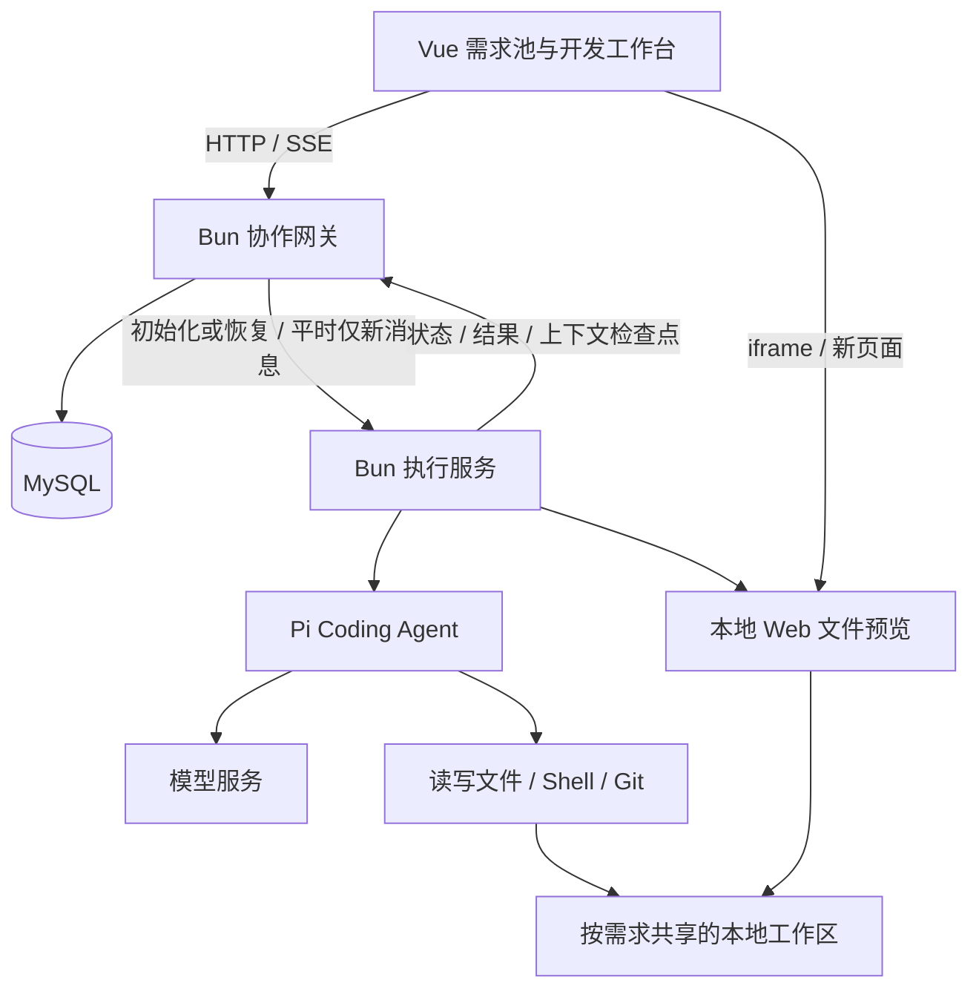

> 历史设计/研究快照。2026-09-29 的后端独立化已调整目录、数据归属和执行接口；当前实现见 [ADR-0003](adr/0003-independent-llm-backend.md)、[HTTP 协议](LLM_HTTP_API.md) 与 [README](../README.md)。本文旧源码路径和行号仅供历史参考。

# ai_dev 本地最小工程设计

日期：2026-09-29

状态：首期核心实现已完成，验证与当前取舍见 [验证记录](VERIFICATION.md)。范围为本地 Mac、Vue、全 Bun、MySQL、Pi Coding Agent，只实现需求会话与 AI 开发。

## 1. 用户使用流程

1. 打开统一需求池，填写需求标题、原始需求和本地 Git 仓库路径。
2. 为需求建立持久工作目录和需求分支，进入开发页面。
3. 在会话中与 Pi 交流，查看流式回复、工具执行、文件和代码差异。
4. 创建其他会话继续讨论或开发；会话上下文独立，代码与预览共享。
5. 查看 Web 页面预览；关闭页面或重启服务后能找回需求、历史和代码。

首期不提供资料上传、设备管理、构建制品管理、系统测试、产品发布、远程开发机、SDK Runner 或用户权限管理页面。Agent 执行本机编译或测试命令属于开发工具能力，不扩展为独立产品模块。

## 2. 最小运行结构

一个工程、两套 Bun 服务，首期都运行在本地 Mac。协作网关管理需求、会话和持久化；执行服务持有 Pi 会话，在代码所在机器完成模型与工具循环。后续可将网关迁到云端，但首期不实现云端部署、机器调度或跨网络接入。



预览沿用独立 HTTP 端口，由执行服务启动。Vite 开发中间件及构建后的 Vue 静态页面由协作网关提供。浏览器经网关获取会话、文件和差异；本机预览使用独立来源的 iframe 或新页面。

只有网关访问 MySQL，只有执行服务持有模型凭据并调用 Pi。执行服务持有活跃上下文，网关保存可恢复的检查点；Agent 不直接操作业务数据库。文件与 Shell 工具不经过网关逐次远程执行。

## 3. 技术与迁移选择

| 项目 | 提案 |
|---|---|
| 前端 | 复用现有 Vue + Vite 和聊天、工具卡片、工作区组件 |
| 后端 | 两个 Bun + Express 入口；网关与执行服务通过本机 HTTP / SSE 通信 |
| Agent | 复用 @earendil-works/pi-coding-agent；迁移时先沿用现有锁定版本 |
| 数据库访问 | Bun.SQL 连接 MySQL，使用参数化 SQL 和简单迁移文件 |
| 实时更新 | 延续现有 SSE 会话状态推送 |
| 本地代码 | 每需求一个 Git 工作目录与需求分支 |
| 配置 | 网关读取 MySQL 配置，执行服务读取模型凭据；首期固定本机执行服务地址 |

Bun 官方提供 [Express 运行指引](https://bun.sh/guides/ecosystem/express)和 [MySQL 原生 SQL 客户端](https://bun.sh/docs/runtime/sql)。这支持上述技术选择，但 Pi SDK 的工具执行、流式事件和停止行为仍需在本机 Bun 下验证，不能用通用兼容说明代替验证。

## 4. 工程目录

以下为设计结构，实际启动与文件说明见 [README](../README.md)：

```text
ai_dev/
├── package.json
├── bun.lock
├── .env.example
├── server.mjs                  # Bun 协作网关入口
├── executor.mjs                # Bun Pi 执行服务入口
├── vite.config.js
├── frontend/
│   ├── index.html
│   └── src/
│       ├── App.vue
│       ├── pages/
│       │   ├── RequirementsPage.vue
│       │   └── DevelopmentPage.vue
│       ├── components/         # 搬迁 Pi 聊天/工具/文件/差异组件
│       └── composables/useSession.js
├── backend/
│   ├── gateway/
│   │   ├── db.mjs              # MySQL 连接
│   │   ├── requirements.mjs    # 需求及共享说明
│   │   ├── conversations.mjs   # 会话、执行与检查点存取
│   │   ├── http.mjs            # 浏览器 API / SSE
│   │   └── executor-client.mjs # 下发请求、接收执行事件
│   ├── executor/
│   │   ├── http.mjs            # 本机执行协议与预览
│   │   ├── sessions.mjs        # 按会话缓存 Pi 实例
│   │   ├── session.mjs         # 执行生命周期和事件适配
│   │   ├── pi-agent.mjs        # 复用 Pi Coding Agent
│   │   ├── models.mjs
│   │   └── workspace.mjs       # 工作目录、Git 与差异
│   └── redact.mjs
├── migrations/001_initial.sql
├── scripts/
│   ├── migrate.mjs
│   └── dev.mjs                 # 一条命令启动两个 Bun 服务
├── tests/
├── .data/                      # 本地运行配置，忽略提交
├── workspaces/                 # 每需求工作目录，忽略提交
├── CONTEXT.md
└── docs/
```

沿用现有 JavaScript/Vue 文件，减少为语言迁移而进行的重写。原 pi-web-demo 保留，搬迁使用复制后的独立代码；DeepSeek Harness、Quickstart 演示入口和样例项目不纳入新工程。

## 5. 页面与交互

### 统一需求池

展示标题、原始需求摘要和更新时间，支持创建、搜索、进入需求。创建表单只要求标题、原始需求、本地仓库路径，基线默认当前提交，分支名由系统建议。

### 需求开发

保留需求中心原型的组织方式：左侧会话列表，中间需求说明与 Pi 对话，右侧 Pi 文件、差异和 Web 预览。

复用 ChatTurn、ChatComposer、WorkspacePanel 和 useSession，替换 Demo 品牌、固定身份和样例提示。需求原文与澄清后说明放在可收起的说明区；不新增概览、制品和测试等空页签。

首期一个对话入口，不增加讨论/开发模式切换；用户直接描述要讨论或执行的内容。澄清后说明由 Agent 调用需求更新工具，经执行服务交给网关保存，所有会话查看同一份最新说明。

保留发送、停止、继续、新建/切换会话、文件查看、差异和预览。不迁移原 Demo 的整目录撤销与清空历史，继续开发通过新消息进行。

## 6. MySQL 最小数据模型

建议三张业务表；每张均包含创建和更新时间，不单独建设流程引擎或事件总线。

| 表 | 主要字段 | 用途 |
|---|---|---|
| requirements | id、title、original_description、clarified_description、repository_path、base_ref、branch_name、workspace_path | 需求说明及共享代码现场 |
| conversations | id、requirement_id、title、model、context_messages（JSON）、checkpoint_turn_id | 会话身份、模型、Pi 原生上下文及其所属执行轮次 |
| turns | id、conversation_id、prompt、blocks（JSON）、status、source_ref（JSON）、started_at、finished_at | 一轮执行的用户消息、回复、工具结果、状态和代码结果 |

关系：一个需求对应多个会话，一个会话对应多轮执行。会话共同读取需求的 workspace_path，但分别恢复自己的 context_messages。

context_messages 保留 Pi 原生消息与工具结果；blocks 为前端展示格式，两者各有用途。数据库保存文本与结构化记录，源码和 Git 数据留在工作目录，不把整份代码以 base64 存入 MySQL。

网关在下发前保存用户消息和本轮执行标识。执行服务在完整模型/工具消息边界及轮次结束回传上下文检查点，由网关保存；流式增量用于界面更新，不要求每个字符单独写数据库。首期检查点可回传完整 Pi 消息快照，不必实现通用增量日志系统；这不等于每次用户发送消息都向开发机下发全部历史。

浏览器关闭不停止执行。网关重启先向执行服务查询运行状态，不能直接把仍在运行的任务标为中断。执行进程退出后，从最近检查点恢复会话，未完成轮次标为中断，保留已保存消息，不自动重放可能有副作用的工具；用户继续时先检查当前文件。上下文恢复不回滚工作区，也不能保证找回尚未保存的最后一段输出。

## 7. 最小接口

接口为设计提案，统一使用需求和会话 ID，取消 Demo 对 9 位 appID 的限制。

| 操作 | 路径 | 核心内容 |
|---|---|---|
| 需求列表/创建 | GET / POST /api/requirements | 标题、需求内容、仓库路径 |
| 需求详情/说明更新 | GET / PATCH /api/requirements/:id | 原始需求、澄清后说明、工作区 |
| 会话列表/创建 | GET / POST /api/requirements/:id/conversations | 会话标题与模型 |
| 获取会话 | GET /api/conversations/:id/state | 历史、本轮状态 |
| 发送消息 | POST /api/conversations/:id/chat | message；返回本轮执行标识 |
| 停止执行 | POST /api/conversations/:id/stop | 停止当前会话的执行 |
| 流式更新 | GET /api/conversations/:id/events | 复用现有 SSE 状态格式 |
| 文件列表/内容 | GET /api/requirements/:id/files 或 /file | 需求共享文件；path 查询参数 |
| 代码差异 | GET /api/requirements/:id/diff | 相对需求初始基线的累计变化 |
| 预览 | 独立端口 /r/:requirementId/ | 需求工作目录中的 Web 文件 |

### 网关与执行服务的最小契约

| 操作 | 输入 | 输出 |
|---|---|---|
| 准备需求工作区 | 需求 ID、本地仓库路径、基线、需求分支 | 工作区路径、分支与基线提交 |
| 初始化 / 恢复会话 | 需求 ID、会话 ID、工作区路径、需求说明、模型；恢复时附 Pi 检查点 | 会话就绪状态 |
| 执行新消息 | 会话 ID、执行轮次 ID、新消息；有变化时附最新需求说明 | 接收结果；持续返回回复、工具状态与执行结果 |
| 查询 / 停止执行 | 会话 ID、执行轮次 ID | 当前状态 / 停止结果 |
| 回传检查点 | 会话 ID、执行轮次 ID、Pi 原生消息 | 网关持久化确认 |
| 更新澄清后需求 | 需求 ID、澄清后说明 | 保存后的需求说明 |
| 获取文件 / 差异 / 预览入口 | 需求 ID、可选文件路径 | 文件内容、累计差异或预览地址 |

固定连接本机执行服务，使用 HTTP 请求和 SSE 事件，不引入消息队列、分布式调度或额外 LLM 路由器。执行轮次 ID 用于关联事件和防止重复下发启动同一轮；需求更新工具经内部请求得到保存确认，不让模型用 Shell 访问数据库。

### 一次用户输入如何传递

1. 浏览器只发送新消息；网关先保存消息并定位会话。
2. 执行服务已有该 Pi 会话时，只下发新消息及必要的需求说明变化，不发送全文。
3. 首次初始化发送需求与工作区信息；实例丢失时先恢复最近检查点，再处理新消息。中断轮次按上一节处理，不盲目重放。
4. Pi 在本机读取代码、调用模型、执行工具，将进度与结果返回网关；网关保存并推送前端。

多会话共享代码，但不自动互传对话历史。增量下发节省的是网关与开发机间的重复传输；Pi 请求模型仍需携带当前所需上下文，不能据此承诺节省模型输入 Token。未来迁移开发机还需要恢复代码与运行环境，不是只传会话历史；首期不实现迁移。

## 8. 共享代码与迁移边界

建议使用 Git worktree 从本地仓库的已提交基线准备需求目录。开发不修改用户原仓库当前工作目录，不自动复制其中未提交的修改。首期只支持已有 Git 仓库，并为每个需求新建独立分支。

同一会话保持单轮顺序执行，不同会话可以并发；不增加需求级排队。多会话的代码变化通过共同工作目录可见。

原 Demo 的 before/after 整目录快照不能直接用来表示某个会话独占的代码修改。首期文件面板显示“需求累计改动”，不把期间其他会话的修改归因给当前会话。原生 edit 的匹配检查保留；涉及整文件覆盖时需核对读取后的文件变化。Shell 也可修改文件，不能宣称这些检查保证所有并发命令无冲突。

提交仍由 Agent 判断；本期不增加自动合并主干、推送和发布。迁移时修改 Demo 中“仅在用户明确要求时提交”的提示，使其符合已确定的自主提交原则。直接提示“不提交”与既有架构不一致，不能原样复制。

## 9. 本地启动与验证

计划提供 bun install、bun run db:migrate、bun run dev、bun run build、bun run start。所有项目脚本均使用 Bun；Agent 执行的 Git、Shell、编译器等仍使用本地对应工具。

dev / start 统一启动网关和执行服务，仍为两个 Bun 进程，共用一个 package.json 和锁文件。配置包含数据库连接、模型凭据、网关与执行服务端口、预览端口、工作目录根路径。前端不接收模型密钥或数据库连接串；两个服务仅监听本机回环地址。首期不做用户权限不代表可以将本地 Shell 执行入口直接暴露到公网。

迁移验证聚焦：

- Bun 下 Pi 能创建会话、调用模型、执行读写和 Shell、返回流式事件并停止。
- 创建需求后能进入 Pi 开发页面，实际代码写入该需求的目录。
- 两个会话共用代码，彼此对话上下文独立；刷新和重启后可恢复历史。
- 正常多轮消息不重复下发全文；执行实例丢失后可从检查点恢复，不重复执行已运行的工具。
- 浏览器断开不取消执行；网关重启能重新查询仍存活的执行，执行服务重启能明确显示中断状态。
- 文件、差异与 Web 预览对应同一需求目录。
- 缺少 Web 入口时显示真实的无预览状态，不伪造 Android 或桌面画面。

上述核心链路已执行验证。首期目前在轮次结束保存完整 Pi 检查点，而非每个工具消息边界；中断轮次不自动重放。详细结果及其他限制见 [验证记录](VERIFICATION.md)。
