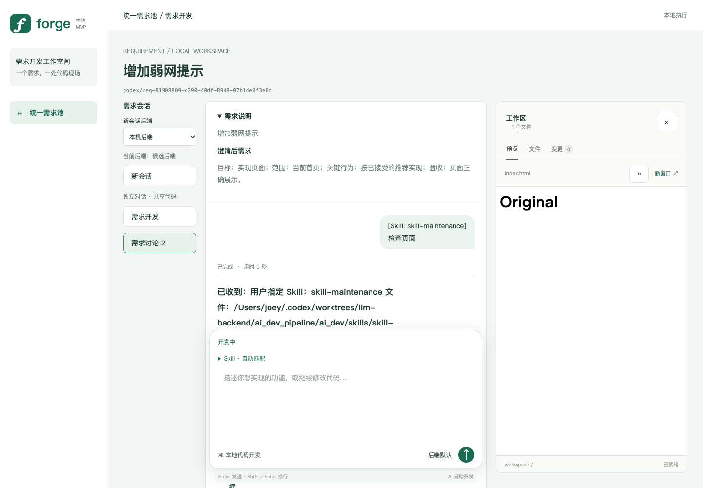

> 本文件保留上一版 runId 协议的计划/验证历史；当前 session 协议见 docs/LLM_HTTP_API.md、docs/SESSION_API_VERIFICATION.md 和 tasks/session-api-plan.md。

# 大模型后端独立化验证

2026-09-29；分支 `codex/llm-backend`；基点 `1dfe9f6`。实现位于独立 managed worktree，未合并主分支、未迁移主数据库、未重启主应用。主工作区中的其他未提交修改未动。

## 环境与结果

- Bun 1.4.2，独立 MySQL 8.4 容器 `llm-backend-tdd`；数据库 `ai_dev_test_llm`。
- `bun test`：25 项通过，0 失败（17 个文件）。
- `bun run build`：通过。
- `bun run smoke:ui`：Chrome 浏览器 1 项通过，35 个断言；完成澄清、自动开发、新会话后端选择、刷新后的原绑定、Skill、预览及窄屏操作。
- `git diff --check`：通过。

所有确定性测试只替代外部模型 HTTP；Pi、Bun HTTP/SSE、MySQL、Git、工作区文件和 Chrome 均实际运行。进程恢复测试实际使用 SIGKILL。没有使用真实 DeepSeek 凭据或产生真实模型费用。本次更新了 `smoke:pi` 的新协议入口，但未运行付费模型 smoke。

## 已覆盖行为

1. chat 执行、事件重放、请求幂等、后端重启后原生历史续聊。
2. 外部 Skill 注入，Tool 调用/结果往返、失败语义、重复结果及冲突。
3. 只读能力限制、同名工具拒绝、覆盖文件前读取、路径和符号链接限制。
4. 等待工具时崩溃后恢复原调用；停止、迟到结果、发送后立即停止，以及网关断线期间的停止。
5. 未澄清时限制所有会话，接受推荐仍算回答；成功结论触发唯一自动开发，失败不放行。
6. 新默认后端仅作用于新会话，旧绑定保持；使用两个独立后端进程验证。
7. 旧 Pi 上下文一次性导入、保留源数据、重复导入不覆盖新对话；未迁移时拒绝续聊。
8. 网关拥有工作区和预览，需求、文件、差异、空仓库保护及启动关闭回归。
9. 后端明确 HTTP 拒绝显示 error，不永久 running。

## 独立复核与限制

按 code-review 分为规范与方案两轴只读复核，修复了派发事务窗口、终态 Tool 重放、已接受任务丢失后重跑、stop/结果恢复竞态及完成运行时未释放问题。另补齐明确 4xx 拒绝的错误显示。

尚无第二种真实引擎接入，因此上述路由验证不代表已经完成跨引擎兼容性认证。首版依旧是同机可信环境；无 OS 沙箱、远程工作区同步或 MCP。不同后端不迁移原生上下文。

截图使用确定性模型，回复中的回显正文仅为测试数据。
