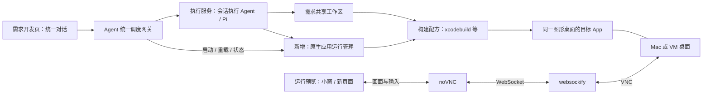

# macOS 开发机与原生应用运行预览调研

调研日期：2026-09-29。状态：方案建议；完成本地源码、上层讨论与官方资料核对，尚未安装或实测远程桌面链路。

## 1. 建议

针对当前 ai_dev，推荐 **现有 Pi 执行服务 + macOS 构建/启动适配器 + noVNC + websockify + macOS 屏幕共享**。先在一台已登录图形桌面的 Mac 上，完成一个需求的原生应用开发、启动、浏览器查看和操作闭环。

需要多个需求拥有互不干扰的桌面时，推荐验证 **Lume 管理 macOS 虚拟机**：每个活跃需求分配一个持久 VM，执行服务、共享工作区、构建与目标 App 都在 VM 内。浏览器继续复用 noVNC 接入。物理开发机与 VM 采用同一个运行预览业务接口。

首个 PoC 展示完整桌面，将应用置前；如果产品要求只展示应用窗口、同步音频或高帧率视频，则另行验证 ScreenCaptureKit + WebRTC。普通表单、工具类 Mac App 可以优先走 VNC；云游戏 SDK 的音视频体验不能据此验收。

## 2. 与已有讨论的关系

| 当前依据 | 应沿用的决策 |
|---|---|
| `../CONTEXT.md`、本项目 `CONTEXT.md` | 需求会话共享工作区；运行预览用于查看与操作，不代表系统测试通过 |
| `../research/docs/PRODUCT_OVERVIEW.md` 的运行预览 | 按需求＋平台共享；小窗、新页面、完整桌面连接同一环境；用户和 AI 可操作，不设置控制权交接 |
| `../research/docs/MVP_MODULE_ARCHITECTURE.md` | 开发机资源、AI 开发、运行交互、构建安装职责分开，逻辑模块不等于独立服务 |
| `../research/docs/MVP_TECHNICAL_ARCHITECTURE.md` | 桌面连接 Agent 所在的同一环境；曾推荐 Guacamole + VNC |
| `docs/adr/0001-local-mac-pi-mvp.md`、`docs/ENGINEERING_DESIGN.md` | 当前实际落地是 Vue/Bun/MySQL、本地 Mac、网关与执行服务分离；首期只做 Web 预览 |

本方案是扩展当前范围的建议。旧研究中的 React/PostgreSQL/Linux 节点方案不覆盖当前已落地的 Vue/Bun/MySQL 选择。Guacamole 可以保留为后续集中接入选项，但目前只有本地 Mac，先用 noVNC 的集成面更小。

## 3. 模块与调用关系

网关管理需求归属和预览状态，执行服务在代码所在机器完成开发及构建。媒体流走独立 WebSocket 路径，不混入聊天 SSE，不写进 MySQL。MySQL 仅保存运行关联、状态和必要日志引用。

| 模块 | 输入 → 输出 | 现状与扩展 |
|---|---|---|
| 需求开发页 | 需求 → 对话、文件、预览 | `frontend/src/pages/DevelopmentPage.vue` 获取预览 URL；增加预览类型和运行状态 |
| 运行预览面板 | 预览描述 → 网页或桌面 | `frontend/src/components/WorkspacePanel.vue` 当前 iframe；增加桌面组件和重载/重连区分 |
| 协作网关 | 需求 ID、动作 → 状态与连接入口 | `backend/gateway/http.mjs` 转发工作区查询；增加原生应用运行接口 |
| 执行服务 | 工作区、配方 → 构建与运行结果 | `backend/executor/http.mjs` 当前只返回静态文件 URL；新增运行管理模块 |
| 会话执行 Agent | 会话上下文 → 代码修改、开发验证 | `backend/executor/pi-agent.mjs` 目前默认生成 HTML；按目标平台选择提示词与工具 |
| 桌面接入 | 已分配桌面 → 画面、键鼠通道 | 新增 noVNC/websockify；不承担代码构建 |
| 开发机管理 | 平台/工具链需求 → 可用桌面环境 | 第一阶段固定本地节点；并发隔离阶段接入 Lume |

当前静态文件预览设置了 `connect-src 'none'` 和沙箱限制，不能把远程桌面客户端直接塞进工作区静态页面。应由产品前端提供受信任的桌面组件和独立连接策略，保留生成页面原有隔离。

## 4. 开源项目选型

| 项目 | 可复用能力 | 与本项目的关系 | 选择 |
|---|---|---|---|
| [noVNC](https://github.com/novnc/noVNC) | 浏览器 VNC 客户端，画面缩放、键鼠和剪贴板；主要 MPL-2.0 | 可直接封装 Vue 组件，后端 VNC 服务需另备 | **第一阶段采用** |
| [websockify](https://github.com/novnc/websockify) | WebSocket ↔ TCP 桥接；LGPL-3.0 | 将浏览器连接转给 Mac VNC；不提供 macOS 桌面本身 | **第一阶段采用独立进程** |
| [Apache Guacamole](https://guacamole.apache.org/doc/gug/guacamole-architecture.html) | 浏览器远程桌面网关，支持 VNC/RDP/SSH；Web 应用与 guacd 分层 | 对多平台集中连接有价值；当前会新增一套服务与集成工作 | 后续跨平台集中接入候选 |
| [Lume / Cua](https://github.com/trycua/cua) | Apple Virtualization Framework 上的 macOS/Linux VM 管理；仓库 MIT | 提供需求独立桌面，Pi 仍负责开发；无需替换整个 Agent 框架 | **隔离阶段优先验证** |
| [Tart](https://github.com/openai/tart) | macOS VM 与开发环境管理 | 当前 LICENSE 为 FSL-1.1-ALv2，存在用途条件，不能直接当作无条件宽松开源依赖 | 技术备选，采用前按所选版本评估许可 |
| [RustDesk](https://github.com/rustdesk/rustdesk) | 可自部署的远程桌面应用，AGPL-3.0 | 适合直接远程连机器；仓库开源不等于当前 Web 客户端的全部部署能力都可直接嵌入 | 备用人工远程入口，非首选嵌入组件 |
| [Appium Mac2](https://github.com/appium/appium-mac2-driver) | 基于 XCTest 的 macOS UI 自动化 | 用于元素定位、操作和结果断言，不是视频预览 | 自动化验证阶段采用候选 |

许可证信息来自调研时的仓库声明；依赖锁定时保存具体版本和许可证文件。Tart 原 cirruslabs 地址在本次查询中重定向到 openai/tart，以当前仓库为准。[Tart 许可](https://github.com/openai/tart/blob/main/LICENSE)、[Cua 许可](https://github.com/trycua/cua/blob/main/LICENSE.md)、[websockify 许可](https://github.com/novnc/websockify/blob/master/COPYING)。

不建议只用浏览器屏幕共享作为最终方案：它主要解决观看，不能自动补齐远程键鼠、应用生命周期和需求归属。例如 [Screego](https://github.com/screego/server) 定位就是屏幕分享。

## 5. 为什么能落地，以及实际限制

### Mac App 开发与启动

Pi 已能操作本机文件和 Shell，缺少的是工程类型与运行生命周期约束。先选一个简单 SwiftUI/AppKit 示例工程，通过显式 build/run 配方开发，而不是让 Agent 每次自由猜测启动命令。

建议流程：固定本次构建输入 → 构建到独立输出目录 → 构建成功 → 停止该需求的旧进程 → 启动新 App → 检查进程和窗口 → 标记可预览。失败时保留日志和最后成功版本标识，避免把旧画面显示为新版本。构建期间共享工作区仍可编辑，因此必须复制/固定输入或明确记录源码摘要，不能只用 HEAD 代表包含未提交修改的运行代码。

第一阶段采用“重新加载＝重新构建并启动”，不承诺 Swift 原生应用通用热更新。Xcode Canvas 也不等于用户正在操作的运行中应用。

本机只读检查结果：macOS 26.6.2、arm64，`xcode-select -p` 指向 `/Library/Developer/CommandLineTools`。这证明当前选中的是 Command Line Tools，不能证明没有另外安装 Xcode。Xcode 工程 PoC 开始前需确认完整 Xcode、SDK、scheme 和具体工程的开发签名要求。本次没有修改工具链。

### 浏览器连接 macOS 桌面

Apple 官方支持屏幕共享与 VNC；noVNC 官方列出了 Apple Diffie-Hellman 等认证方式，并要求 WebSocket 服务或桥接。因此链路具有文档层面的可行性，但当前 macOS 与固定 noVNC 版本的认证、多连接行为仍需实测。[Apple 屏幕共享](https://support.apple.com/en-sg/guide/mac-help/mh11848/mac)、[noVNC README](https://github.com/novnc/noVNC)。

第一阶段明确连接已登录用户的现有桌面，验证目标 App 与执行服务处于同一用户和 GUI 会话。仅能 SSH 执行命令，不代表 App 一定会出现在被预览的桌面。后续将启动代理放在相应用户的 GUI 会话中管理。

noVNC 的缩放只改变浏览器展示大小；是否能改变远端分辨率取决于服务端。多显示器、Retina 坐标、中文输入法、Command 快捷键和剪贴板均需真机验收。浏览器能显示不等于这些交互已经兼容。

### 同机观看与并发

同一 Mac 打开浏览器并预览自身完整桌面，会出现画面递归，并且浏览器焦点、目标 App 焦点和真实鼠标共享。PoC 可以用第二台设备查看；日常本机体验建议用 VM 内桌面，或后续实现单窗口采集。第二台显示器只能改善画面组织，不能隔离输入。

第一阶段将一台桌面作为一个活跃需求的预览资源。同需求多个会话共享它；不引入用户与 AI 的控制权交接。不同需求需要同时独立操作时，为每个需求分配 VM 或独立 Mac。多个 Git worktree、多个应用 PID、多个 macOS 账号本身都不能证明图形桌面已经隔离。

同需求多人/AI 同时输入仍可能竞争焦点，这属于共享交互的真实行为。构建与重启操作则在同一运行实例内串行化，避免两个会话互相终止应用；这不限制代码编辑并发。小窗与新页面的同时连接是否互踢需 PoC 验证，不能只凭客户端 shared 标记保证。

### 声音、性能与应用窗口

基础 VNC 不提供音频。Guacamole 的 VNC 音频方案另接 PulseAudio，不能据此宣称自动支持 macOS 系统声音。[Guacamole 音频说明](https://guacamole.apache.org/doc/gug/configuring-guacamole.html#vnc)。

需要单窗口和音视频时，可用 Apple [ScreenCaptureKit](https://developer.apple.com/documentation/screencapturekit) 采集，结合 VideoToolbox 编码、WebRTC 传输与独立输入通道。这里需要自研 macOS helper，处理窗口筛选、弹窗、缩放坐标、权限和重连。它不是安装一个前端包就能获得的能力，不纳入首个版本。

### 权限与部署边界

本地 PoC 的产品服务、桥接入口继续监听 loopback。Apple 系统屏幕共享服务可能监听网络接口，不能因为 websockify 监听本地就声称整个 VNC 服务仅本地可达；需核验监听与防火墙范围。

跨机器使用时，保留 gateway/executor 内部端口限制，通过受认证接入层和加密隧道连接。预览地址只引用已授权的运行实例，不接受浏览器任意指定 VNC host/port。长期桌面密码不放 URL、数据库明文字段或日志；WebSocket 握手应校验来源和访问权限。

自研采集/自动化 helper 的屏幕录制、辅助功能等权限需通过 macOS 授权；VM 中也需要独立准备，不承诺复制宿主机授权或无人值守跳过系统提示。正式分发签名、公证属于产品发布流程，和本次本机开发运行分开。

## 6. 最小接口与产品交互

建议先增加统一预览描述，不再只返回 `url`：

| 字段 | 含义 |
|---|---|
| `kind` | `web` 或 `macos-desktop` |
| `runtimeId` | 当前运行实例；小窗、新页面共享 |
| `requirementId` | 归属需求 |
| `state` | 未启动、构建中、启动中、运行中、失败 |
| `entryUrl` | 产品的预览入口，不是裸 VNC 地址 |
| `sourceRef` | 实际运行对应的源码快照/摘要 |
| `capabilities` | 能否输入、重载、播放音频等已确认能力 |

执行服务提供 start/reload/stop/status；预览组件提供“重新构建并运行”“重新连接”“新页面”。断线只重连画面，不触发重新构建；关闭小窗只释放订阅，不停止 App。停止运行属于显式动作或运行资源回收策略。

Agent 提示词按平台选择，去掉 Mac 需求的默认 HTML 假设。启动/停止尽量走统一运行工具，避免 Agent 与按钮各自维护一套进程。后续接入 Cua Driver 或 Mac2 时只复用本机操作能力，不引入第二套需求编排或替换 Pi 的对话上下文。

## 7. 分阶段验证与投入估算

下列为一名熟悉本项目开发者的工程估算，不是已测得工期；以普通工具类 SwiftUI 示例、已有可用 Mac 为前提。

| 阶段 | 内容 | 估算 | 通过标准 |
|---|---|---|---|
| A：技术 PoC | Xcode 示例构建启动；noVNC + websockify 连接同一 Mac | 1–2 人日 | 浏览器能操作真实 App；改代码重建后可见变化 |
| B：项目接入 | 配方、进程生命周期、预览状态、Vue 桌面面板、失败恢复 | 3–5 人日 | 同需求共享预览；重载成功/失败可区分；断线重连不重启 App |
| C：需求隔离 | Lume 基础镜像、VM 内 executor、分配/回收与恢复 | 另加 3–7 人日 | 两个需求同时运行，鼠标、窗口、进程互不干扰 |
| D：窗口与音视频 | 原生采集 helper + WebRTC + 输入映射 | 单独 PoC 后估算 | 在目标网络测量声音、清晰度、输入延迟和帧率 |

阶段 A 必测：中文输入、Command-C/V、缩放后的点击坐标、模态弹窗、两浏览器连接、窗口关闭/应用崩溃、构建失败、锁屏/休眠后的恢复。记录局域网输入到画面更新延迟与资源占用，不预先承诺固定帧率。

阶段 C 先测一台 VM 内的 Xcode 构建与真实 App；再决定资源配额。Lume 官方入门要求 Apple Silicon，并列出可用内存和磁盘前提，但基础 VM 能启动不代表 Xcode 并发容量足够。可以从每 VM 8–12 GB 内存、80–120 GB 磁盘作为容量验证起点；这是规划假设，需要根据工程和宿主机资源实测调整。[Lume 入门](https://github.com/trycua/cua/blob/main/docs/content/docs/tutorials/create-your-first-lume-vm.mdx)。

涉及 Metal、音视频硬件编解码、摄像头、USB 或云游戏 SDK 时，VM 行为必须单独验证，保留物理 Mac 作为目标硬件验证资源。选择 VM 不能替代设备兼容性验证。

## 8. 当前结论的证据边界

- 已核对：上层产品讨论、当前模块与预览调用、Agent 默认提示词、本机架构与选中工具链、候选项目官方资料和许可声明。
- 尚未验证：本机 VNC 认证、中文输入、多订阅、应用构建启动、Lume VM 内运行及目标业务应用兼容性。
- 下一步优先产物：一个真实 SwiftUI 示例的端到端 PoC 及测量记录；通过后按阶段 B 接入产品。暂不需要部署完整设备农场或云端调度系统。
