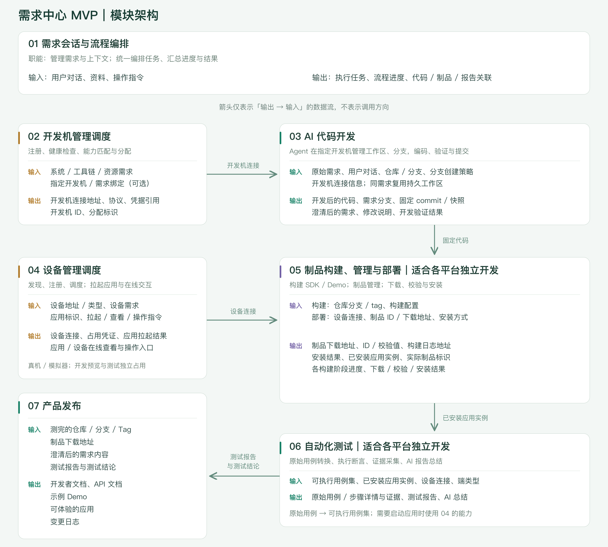

# 需求中心 MVP：模块划分与架构说明

日期：2026-09-28

本文是平台架构综述，说明产品目标、模块分工和核心流程，不展开接口、部署方案与实现细节。以下为设计方案，不代表能力已经实现。

## 1. 产品目标与首期范围

让业务与研发围绕同一个需求，完成从提出需求、AI 辅助开发与实时预览，到自动化测试和产品交付的闭环。

**提出需求 → 澄清与开发 → 运行预览 → 构建与安装 → 自动化测试 → 产品发布**

首期以需求为中心，每个需求对应一个 Android 平台任务。多会话共享代码与预览，各自保留对话上下文，允许并发修改；用户与 AI 均可操作预览，不设置控制权接管。

预览支持小窗、新页面和完整开发桌面入口。支持热更新的应用直接更新；不支持时，通过“重新加载”完成重新构建、安装与启动。设备采用自部署或自研云真机平台，具体产品另行选型。

本期不引入产品版本、冻结、发布渠道、人工验收、独立提交记录页面和用户权限管理模块。

**本期“产品发布”指生成并提供开发者文档、API 文档、示例 Demo、可体验应用和变更日志，不包含生产上线或应用商店上架。**

保留三项核心原则：

- **开发现场持续复用**：一个需求对应一个持久工作区和需求分支。
- **构建与测试对应固定代码**：后续开发不改变历史制品和测试所对应的内容。
- **原始结果与 AI 总结分开**：保留逐用例、逐步骤的测试事实，AI 总结不替代原始结果。

## 2. 总体架构图

[高清 PNG](diagrams/mvp-module-contracts.png) · [可编辑 SVG](diagrams/mvp-module-contracts.svg)

01 统一管理需求与执行过程；02、04 提供开发机与设备能力；03、05、06、07 分别完成开发、构建安装、测试和产品发布。这些是逻辑模块，不要求分别部署为七个服务。

图中箭头表示**输出 → 输入**，不表示调用方向。产品发布除接收 06 的测试结果外，还接收已测试的代码、制品地址和澄清后的需求，图中不逐一连线。

## 3. 模块职责与核心输入输出

### 01 需求会话与流程编排

- **职责**：管理需求、资料和会话上下文，组织执行流程，汇总进度与结果。
- **输入**：用户对话、需求资料、操作指令。
- **输出**：执行任务、流程进度，以及需求与代码、预览、制品、报告、发布材料的关联。
- **边界**：管理需求与执行过程，不承担具体编码、构建、安装和测试；需求的理解与澄清由 03 完成。

### 02 开发机管理调度

- **职责**：开发机注册、健康检查、能力匹配与分配，为 AI 开发提供可用的执行环境。
- **输入**：开发机需求，如操作系统、工具链和资源要求；可选指定开发机。
- **输出**：可连接的开发机地址、连接方式与分配结果。
- **边界**：只管理开发机资源；工作区、仓库和分支直接由 03 中的 Agent 管理。

### 03 AI 代码开发

- **职责**：在指定开发机上运行 Agent，澄清需求、管理工作区和分支、修改代码、执行开发验证，并自主决定提交。
- **输入**：原始需求、用户对话、代码仓库与分支、分支创建策略、开发机连接信息。
- **输出**：澄清后的需求、开发后的代码、需求分支与固定提交，以及修改说明和开发验证结果。
- **边界**：负责把需求变成代码；不重复实现设备调度、安装和系统测试能力。

### 04 设备管理调度

- **职责**：发现并注册真机或模拟器，维护连接状态，分配设备，拉起应用，提供应用和完整设备的在线查看与操作。
- **输入**：设备连接地址与类型、设备需求；应用标识及拉起、查看、操作指令。
- **输出**：可连接的设备、分配结果、应用拉起结果，以及应用或设备的在线查看与操作入口。
- **边界**：应用安装由 05 完成；本模块负责启动与运行交互。开发预览和系统测试使用独立设备占用，避免相互干扰。

### 05 制品构建、管理与部署

**适合各平台独立开发。**

- **职责**：构建 SDK、Demo 等制品，管理下载与来源信息，在指定设备上下载、校验并安装应用。
- **输入**：构建所需的仓库分支或 Tag、构建配置；部署所需的设备连接信息、制品下载地址和安装方式。
- **输出**：制品下载地址与标识、构建日志、各阶段进度、安装结果和已安装应用实例。
- **边界**：不负责自启动或自动拉起，不接收外部归档输入，不输出文档文件，也不管理测试报告和证据。

开发预览与自动化测试共用这套构建和安装能力。

### 06 自动化测试

**适合各平台独立开发。**

- **职责**：将原始用例转成可执行用例，执行测试、采集证据，并生成原始报告与 AI 总结。
- **输入**：用例转换时接收原始测试用例；执行时接收可执行用例集、已安装应用实例、设备连接信息和端类型。
- **输出**：转化后的可执行用例；逐用例、逐步骤的测试详情与证据、原始测试报告和 AI 总结。
- **边界**：消费 05 的安装结果，需要启动应用时使用 04 的能力；不重复安装，不用 AI 总结覆盖原始测试事实。测试报告与结论交给 07。

05、06 可以由各平台分别实现，对外保持一致的核心输入输出；首期仍只覆盖 Android。

### 07 产品发布

- **职责**：汇集经过测试的开发成果，生成并提供面向开发者与体验者的交付材料。
- **输入**：测完的仓库、分支或 Tag，制品下载地址，澄清后的需求，以及 06 的测试报告与结论。
- **输出**：开发者文档、API 文档、示例 Demo、可体验的应用和变更日志。
- **边界**：不重复实现构建、安装与测试，不包含生产上线。发布材料应对应被测代码和制品，并如实说明测试结果与已知限制。

## 4. 核心流程

### 4.1 开发与预览

1. 用户在需求会话中提出需求、补充资料，01 组织执行。
2. 02 提供开发机，03 在持久工作区中澄清需求、开发和验证。
3. 应用支持热更新则更新预览；否则由 05 构建，并使用 04 提供的设备完成安装。
4. 04 拉起应用，提供在线查看与操作入口，用户通过预览继续反馈。

### 4.2 系统测试与反馈

1. 选择可执行用例集；原始用例由 06 转换。
2. 04 分配测试设备，05 安装固定制品。
3. 06 执行测试，提供逐用例、逐步骤的详情、证据与 AI 总结。
4. 预览反馈或测试发现问题时，回到同一需求继续开发，再构建和测试。

开发过程验证用于辅助编码；系统测试针对固定候选制品。两者不混为一个结果。

### 4.3 产品发布

1. 01 汇集被测代码、制品、澄清后需求和测试结果。
2. 07 生成开发者文档、API 文档与变更日志，提供示例 Demo 和应用体验入口。
3. 发布材料关联回同一需求；后续修改经过新的构建与测试后，再更新交付材料。

**测试结果是发布的输入，不代表测试执行完毕就无条件发布。整个流程允许围绕同一需求反复迭代。**
