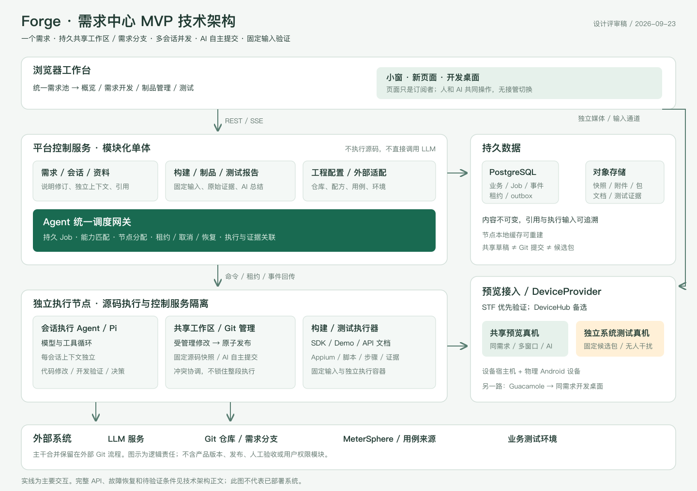

# Forge 需求中心 MVP 技术架构

日期：2026-09-23　｜　状态：完整评审稿，非已实现系统

依据：[MVP v2 原型](../ai-dev-pipeline-mvp-v2.html)、[README 的需求中心 MVP 范围](../README.md)、[产品目标](PRODUCT_OVERVIEW.md)及本轮架构访谈。不从之前的里程碑、任务清单或人员分工反推架构；旧产品说明中的版本、验收和发布流程不进入本期。

**核心方案：模块化单体控制服务 + 独立执行节点 + 自部署云真机平台。需求拥有持久共享工作区和需求分支；会话上下文独立、开发可并发；AI 自主提交；预览、候选包和测试报告通过固定输入关联。**

“已确认”指用户决定；“推荐”指待技术评审、未实机验证的实现方案。容量、时限与保留期均为设计初值，不是实测结论。

## 1. 目标和边界

让业务与研发围绕同一需求完成：表达和补充 → AI 辅助开发 → 直接看到并操作真实效果 → 获得候选包 → 查看系统测试原始过程和 AI 总结。

| 项目 | 已确认边界 |
|---|---|
| 入口 | 一级仅统一需求池；详情为概览、需求开发、制品管理、测试 |
| 平台 | 每需求一个 Android 平台任务 |
| 工作区 | 每需求一个持久工作区和需求分支；会话共享代码/预览，各自保留对话上下文 |
| 并发 | 多会话可同时修改；重叠冲突重新读取协调，不静默覆盖、不将整个需求串行 |
| 引擎 | Pi 在执行节点负责模型与工具循环；Agent 统一调度网关不直接调用 LLM |
| 提交 | AI 决定提交时机和变更范围，不设必经人工确认 |
| 预览 | 用户和 AI 随时可操作，无接管/交换控制权；小窗、新页面、开发桌面 |
| 设备 | 自部署或自研的物理 Android 云真机平台，需要选型 |
| 测试 | 开发测试与候选包系统测试分开；脚本/断言产生事实，AI 总结；MeterSphere 提供用例来源 |
| 交付终点 | 需求分支、候选包、测试报告；主干合并留在外部 Git 流程 |
| 不做 | 产品版本、冻结、发布渠道、人工验收、独立提交页、全局资源管理产品、权限模块 |
| 规模 | 公司内部共享；20 人在线、5 个开发执行、2 个系统测试并发 |

首期不做权限，不增加账号/RBAC/ACL/新 SSO 前置；但仍须隔离执行环境、保护服务密钥和设备控制端口。

### 原型与实现事实

MVP v2 为浏览器内存数据与模拟执行，后定义函数覆盖早期函数。固定弱网用例、固定时间、立即构建完成不能成为真实后端规则；原型的人工确认提交已被本轮决定替代。

[Pi 实验代码](../pi-web-demo/backend/pi-agent.mjs)可复用模型工具循环、事件与停止接口，但其按会话目录、逐文件快照和撤销不满足共享并发要求。该目录正在另行修改，实施时须固定代码与依赖版本；本次仅编写文档，没有修改它。

## 2. 总体架构与技术选型

图中模块不等于微服务。[可编辑 SVG 图源](diagrams/mvp-technical-architecture.svg)；下图补充调用与数据方向。

~~~mermaid
flowchart LR
  U[浏览器工作台] --> C[平台控制服务]
  C --> P[(PostgreSQL)]
  C --> O[(对象存储)]
  C --> G[Agent 统一调度网关]
  G --> N[执行节点管理器]
  N --> A[会话执行 Agent / Pi]
  A --> L[LLM 服务]
  A --> W[共享工作区管理器]
  W --> Git[Git 需求分支]
  N --> B[构建与测试执行器]
  B --> O
  U --> V[预览接入服务]
  A --> V
  V --> D[DeviceProvider / 自部署设备池]
  B --> D
  V --> Desktop[同需求开发桌面]
  C --> MS[MeterSphere 适配器]
~~~

### 2.1 推荐技术栈

| 层 | 推荐 | 边界 |
|---|---|---|
| 前端 | React + TypeScript + Vite，查询缓存与事件增量刷新 | 按原型迁移交互，不继续叠加覆盖函数；无需 SSR |
| 控制服务 | Node.js 受维护 LTS + TypeScript + Fastify，模块化单体 | API 与调度可运行不同进程，共享代码库与数据库 |
| 持久状态 | PostgreSQL | 业务表、任务、租约、事件和 outbox；同事务提交业务与执行意图 |
| 文件 | S3 兼容对象存储，优先复用已有服务 | 附件、源码对象、制品、日志、证据；具体存储产品由部署环境确定 |
| Agent | 固定版本 Pi，独立进程，自定义受管理工具 | 不把 Pi 内部会话对象直接作为业务契约 |
| 构建 | 固定镜像中的 JDK、Android SDK、工程 Gradle Wrapper | 工程锁文件与配方为准，不依赖开发机隐式环境 |
| 测试 | Appium + UiAutomator2 + pytest；Allure 附件格式可选 | 平台统一结果模型为事实源，不只保存一份 HTML |
| 真机 | DeviceFarmer/STF 优先验证，DeviceHub 备选 | 第 9 节给出取舍，不等于已完成部署 |
| 预览 | 独立画面/输入接入，复用设备底座能力 | 小窗与新页订阅同一会话；必要时自研桥接 |
| 桌面 | Guacamole + 同需求开发环境 VNC | 连接 Agent 所在的同一桌面，而非另开空白桌面 |
| 观测 | 结构化日志、OpenTelemetry 埋点、Prometheus 指标 | 接公司已有采集后端 |

首期不要求 Kubernetes、Kafka、Redis、Temporal、向量数据库或微服务体系。数据库任务队列见第 11 节，不把 NOTIFY 当可靠消息存储。

### 2.2 部署单元

- **控制区：**反向代理、静态前端、API、调度/后台进程、PostgreSQL、对象存储。API 不运行用户源码。
- **开发执行区：**Linux 节点管理器，按需求持久存储，按执行隔离进程/容器，承载 Pi、代码工具与桌面。
- **构建/测试区：**短生命周期容器，固定源码与镜像。初期可与开发节点共主机，但限制资源。
- **设备区：**真机平台控制组件、USB/局域网设备宿主机、物理设备；STF 自身依赖由其部署方案管理，不替代业务数据库。
- **预览接入区：**媒体/输入代理和桌面代理；浏览器不直接接 ADB、节点管理端口或数据库。

推荐单代码库结构：apps/web、control-api、control-worker、node-daemon；packages/contracts、domain、agent-adapter、workspace、device-provider、test-results。无需拆成多个仓库。

## 3. 模块职责与依赖

| 模块 | 拥有的事实 | 提供的能力 | 不负责 |
|---|---|---|---|
| 需求与资料 | 需求、平台任务、说明修订、资料引用、Jira 链接 | 创建、查询、修订、执行输入快照 | 执行工具、占用设备 |
| 会话与上下文 | 消息、会话、模型上下文检查点 | 讨论/开发流、上下文压缩、共享状态提示 | 每会话独立持久代码 |
| Agent 统一调度网关 | Job、执行分配、租约、取消与事件归属 | 能力匹配、调度、重试、状态恢复 | LLM 推理和 shell 执行 |
| 工作区与 Git | 源码快照、变更操作、头指针、Git 提交请求 | 读取、原子发布修改、自主提交、外部提交导入 | 整需求单写队列 |
| 运行预览 | 运行输入、设备租约、订阅者、运行状态 | 小窗/新页/桌面、重载、停止、输入 | 系统测试结论 |
| 构建与制品 | 构建阶段、尝试、文件清单与校验和 | SDK/Demo/文档构建，下载、体验 | 发布、合并主干 |
| 系统测试与报告 | 用例映射、执行/步骤/证据、AI 总结 | 测试概览、用例与步骤、再次执行 | AI 代替原始断言 |
| 工程配置与集成 | 仓库、构建/运行配方、环境、设备、用例接入 | 可复现配置快照、外部适配 | 新增全局管理菜单 |

模块通过应用接口协作，不能任意跨模块更新状态。Agent 通过工具请求变更，不直接拿数据库权限写“测试通过”。

## 4. 领域与数据模型

领域词汇见 [CONTEXT.md](../CONTEXT.md)。ID 使用内部不可变 ID；REQ-101 等为展示编号。

~~~mermaid
erDiagram
  REQUIREMENT ||--|| PLATFORM_TASK : owns
  REQUIREMENT ||--o{ SPEC_REVISION : describes
  REQUIREMENT ||--o{ CONVERSATION : discusses
  CONVERSATION ||--o{ AGENT_RUN : executes
  REQUIREMENT ||--|| WORKSPACE : shares
  WORKSPACE ||--o{ SOURCE_SNAPSHOT : records
  AGENT_RUN ||--o{ CHANGE_OPERATION : publishes
  SOURCE_SNAPSHOT ||--o{ GIT_COMMIT : selects
  REQUIREMENT ||--o| RUNTIME_SESSION : previews
  GIT_COMMIT ||--o{ BUILD : builds
  BUILD ||--o{ ARTIFACT_FILE : produces
  BUILD ||--o{ TEST_RUN : verifies
  TEST_RUN ||--o{ CASE_EXECUTION : contains
  CASE_EXECUTION ||--o{ STEP_EXECUTION : records
  STEP_EXECUTION ||--o{ EVIDENCE : supports
  TEST_RUN ||--o{ AI_REPORT : summarizes
~~~

Snapshot → Commit 是来源关联；局部提交还需选择清单及最终 Git tree，二者内容不一定完全相同。RuntimeSession 关系表示最多一个活动开发预览，历史可多条。

| 数据组 | 关键字段与约束 |
|---|---|
| requirements / platform_tasks | 标题、原始说明、优先级、备注、Jira URL、current_spec_id、时间；task.requirement_id 唯一，Android |
| spec_revisions | requirement_id、revision、结构化正文、source_message_ids、content_hash；追加不覆盖 |
| conversations / messages | requirement_id、mode、message_seq、role、content、attachment_refs；各会话独立顺序与检查点 |
| agent_runs | conversation_id、execution_input_snapshot、模型/适配器配置、job_id、状态与时间 |
| workspaces / source_snapshots | requirement_id 唯一、repo_id、branch_ref、head_snapshot_id、materialized_snapshot_id、node_id、epoch；快照为 path/mode/hash 完整 manifest |
| change_operations | operation_id 唯一、run_id、base_snapshot_id、前后文件哈希、patch、结果 snapshot_id、冲突原因 |
| commit_requests / git_commits | decision_run_id、reason、source_snapshot_id、selected_operations、expected_branch_head、tree/sha、remote_sync_state |
| runtime_sessions / device_leases | desired/installed_snapshot_id、installed_apk_hash、device_id、provider_lease_id、epoch、状态 |
| builds / build_stages / build_attempts | commit_sha、spec_id、recipe_hash、image_digest、阶段依赖与状态；构建编号不是产品版本 |
| artifact_files | build/stage_id、类型、object_key、SHA-256、大小、MIME、入口文件；不可覆盖 |
| suite_bindings / case_mappings | MeterSphere project/case ID、筛选条件、script repo+commit+selector、environment_profile；未映射明确标注 |
| test_runs / case_executions / step_executions | build_id、suite_snapshot、script_commit、环境/设备快照、attempt、输入/预期/实际/断言、时间与状态 |
| evidence / ai_reports | 用例/步骤/尝试关联、对象哈希；报告含 raw_result_digest、model、prompt_revision、证据引用、生成状态 |
| attachments / attachment_refs | 原文件、类型、大小、解析状态；原始资料与提取文本分开存，移除引用不等于删除 |
| jobs / leases / events / outbox | 幂等键、状态、attempt、owner、epoch、deadline、取消标志、sequence |

约束：子记录归属必须与父记录一致，用复合外键或事务校验；时间用 UTC 保存；需求修订、源码快照、提交、构建和测试 ID 不混用；被引用的对象不能被缓存清理删除。仓库范围来自工程配置，AI 不静默扩仓库。

## 5. 会话和 Agent 执行

### 5.1 三种共享边界

- **需求说明共享：**修订带 expectedSpecRevision，冲突重新整合，不覆盖另一会话的说明。
- **代码共享：**共同工作区最新已发布快照可见；每次工具读取固定其使用的基线。
- **上下文独立：**A 的聊天全文不自动塞给 B；B 收到代码/需求更新摘要，并能读取具体变化。

AgentRun 固定开始时的需求修订、资料引用、仓库范围、代码基线、模式与模型配置。发现共享代码变化后可显式刷新并记录新基线，不能偷偷改写原始执行输入。

同一会话消息链有顺序；新消息可追加或显式中断/续作。不同会话的 AgentRun 并发。全局 5 个槽是资源上限，不是需求级单写锁。

### 5.2 Pi 封装与工具

AgentAdapter 提供 start、send、cancel、checkpoint、inspect；输出消息、工具事件、代码操作、开发验证、提交决策和执行终态。Pi/模型/工具版本可追溯，升级跑契约回归。

讨论模式配置需求和只读资料工具；开发模式开放受管理的代码修改、命令、预览、验证与 requestCommit。这是执行模式，不是用户权限体系。模型凭据在执行侧，网关仅传配置引用。AI 测试总结也走受调度执行 Agent，不另造控制服务直调模型链路。

### 5.3 持久化与停止

消息和工具结果追加保存；大日志存对象，模型按需读取。压缩检查点记录覆盖消息范围、源码基线、未完成操作和原始引用。保存粒度是模型轮次/工具边界，不承诺任意 token 的精确恢复。

停止先持久化 cancel_requested，再撤销该 run 工具能力、终止进程组/容器及登记子进程。已发布代码和完成提交保留；其他会话和共享预览不受影响。“停止预览”是独立命令。模型超时、预算耗尽或冲突重试耗尽须明确失败原因和保留成果，不无限循环。

## 6. 共享源码并发与自主提交

**共享不等于多个任意 shell 直接写同一个普通目录，再事后算 diff。**这是本架构需要专门实现和验证的核心。

### 6.1 统一发布协议

Workspace Manager 管理唯一逻辑工作区：不可变内容对象 + 完整 manifest + head_snapshot_id。磁盘目录是物化视图，缓存和构建输出不是源码真相。

1. 修改携带 operationId、runId、baseSnapshotId、patch，校验路径/模式/哈希和删除、二进制操作，读取当前 head。
2. 在事务外比较 base/current，保留未触及文件的变化，执行无歧义三方合并；同位置矛盾、删除/修改或二进制冲突返回 CONFLICT，保留已发布内容。
3. 将合并后的最终 blob 和完整 manifest 持久化。不能只上传 Agent 的原始修改而漏掉合并产生的内容，也不在持锁事务中上传大对象。
4. 短事务校验 head 仍是第 1 步所见值，并原子校验工作区归属 epoch、该 run/attempt 的有效性与取消状态。head 已变化则重新计算，取消或旧租约拒绝发布。
5. 同事务保存新 manifest 引用、操作记录、head 和事件。短时元数据发布有顺序，不把整个开发执行排队；未引用对象稍后回收。
6. 节点构造完整不可变 generation，只有 epoch 有效且仍为当前目标 revision 才能切换活动物化指针，成功后回写 materialized_snapshot_id。旧物化较晚完成不能使指针回退；已运行工具仍持有自己的固定 generation，使用结束再回收。文件系统指针与数据库不是同一事务，generation 内保存快照标识；重启核对真实指针后修复观测字段，核对前不提供不确定的 live 视图。

不能把多文件逐个写入描述为文件系统事务。数据库成功但物化失败可从 manifest 重建；对象失败不推进 head。文本合并成功也不保证业务正确，需对合并结果验证。

### 6.2 文件工具与 shell

现有 Pi 的同进程同路径修改队列不足以覆盖多进程、shell、后台写入和撤销。read/edit/write 必须接上述接口。

源码 generation 对 Agent 容器只读；源码修改命令在**命令级临时可写视图**执行，结束回收进程组，把相对固定基线的差异发布回共享工作区。构建缓存和输出用单独目录。长驻服务由运行管理器登记，不能任意脱离生命周期。

临时视图不是每会话长期分支或持久工作区。禁止 Agent 接触宿主机、Docker socket、管理器 Git 内部目录。若允许任意 shell 直接写 canonical 目录，就无法同时承诺无丢失并发、一致快照和准确归属，不能靠提示词补足。

### 6.3 并发实例

A、B 从 S10 开始。A 改文案发布 S11，B 改同文件阈值：
可兼容则生成含双方修改的 S12；不可兼容则 B 收到新基线与冲突，再读、再改。A 不回滚，其余会话不等待。B 的验证必须基于合并后内容。

### 6.4 AI 自主提交

不设人工确认前置。AI 判断提交时机和范围，并保存理由、来源和开发验证。

推荐默认提交完整共享快照。AI 也可选部分操作/补丁，但必须在 expectedBranchHead 上生成明确完整 tree；有依赖或交叠不能安全分离时重新规划，不能声称“天然只包含我的会话修改”。

Git 管理器使用独立 index、固定 tree 创建 commit，再按预期旧值更新需求分支；禁止对实时目录共享 git add。分支先被别的执行推进时重新协调，不将旧 tree 直接接到新 parent 覆盖新提交。

Git 与数据库无分布式事务：先保存 commit_request 的 tree/parent、作者、提交者、固定时间和说明等完整元数据，生成 commit 后先持久化确切 SHA，再 CAS 更新引用。恢复检查该 SHA 是否已经被分支包含；不能只凭 tree/parent 或用新时间重复生成提交。引用更新前校验请求仍有效，已开始的更新需对账，不能把取消声称为已回滚。推送仅正常快进，远端分歧进入 reconcile，禁止 force push。推送成功作为候选包构建就绪条件；失败显示待同步，保留本地提交。

AI 自主不等于可改写历史、合并主干、扩仓库或发布；这些操作不进入工具契约。

### 6.5 撤销和外部变更

撤销是针对当前状态的反向操作或新 revert commit，有冲突则协调；不整目录恢复。清上下文、取消执行不撤销已有代码。

人工修复通过外部 Git 提交导入，比较共同基线、远端 HEAD 和共享草稿，保存快照再三方合并。分支推进与工作区推进必须显式关联，不能直接拉取覆盖脏目录。

技术原语见 [Git commit-tree](https://git-scm.com/docs/git-commit-tree)、[update-ref](https://git-scm.com/docs/git-update-ref)、[Docker 只读挂载](https://docs.docker.com/engine/storage/bind-mounts/#use-a-read-only-bind-mount)；它们本身不等于端到端事务。

## 7. 运行预览

RuntimeSession 独立于页面和会话。小窗、新页订阅同一个实例；关闭一个窗口不释放设备或工作区。界面分别显示最新源码 S18 与当前设备安装的 S16。

Android 默认“重新加载”：固定 S18 → 编译 Demo → 安装 → 启动。Android 不天然等于 Web 热更新；只有框架明确支持时才启用，并记录实际生效源码。后续 S19 不混入进行中的编译；重复请求可合并未开始项，旧结果不能覆盖新的 desiredSnapshot。编译等装包前失败可保留旧运行；安装/启动后失败则核对实际 APK 哈希和运行状态，不能仍显示旧应用正常运行。回装旧 APK 是需验证的新恢复操作，不保证原应用数据和运行状态可恢复。

用户和 AI 输入同走 Preview Gateway；短手势按序送达，避免 down/move/up 交叉，不设独占控制者。AI 操作后读取新画面/状态，不能假设人没有改变 UI。共享操作允许互相影响，确定性的系统测试必须另租设备。

媒体通道与 SSE 业务事件分开。优先复用底座网页画面；若嵌入、多人订阅不满足需求，自研桥接/fan-out，而非直接假定 iframe 可用。scrcpy/Tango 可作为组件，但需要远程 ADB、流转换、输入和重连。参考 [Tango](https://tangoadb.dev/scrcpy/)。

完整桌面通过 [Guacamole](https://guacamole.apache.org/doc/gug/introduction.html) 连接同需求开发环境 VNC，源码只读；手机投屏不是完整桌面。人工代码修改仍走外部 Git。

推荐空闲 30 分钟暂停预览设备，活跃输入/Agent 操作续活；代码与配置持久保留。恢复可能换设备并重装，明确告知应用状态可能重置，不承诺无限期独占物理设备。

## 8. 构建、候选包与 API 文档

BuildInput 固定需求修订、commitSha、构建配方修订、工具链镜像 digest、依赖锁文件与非敏感配置快照。默认 SDK → Demo，文档可并行，具体依赖来自配方。同 commit 可多次构建；依赖未锁定须标明可复现性风险。

阶段状态：排队/执行/成功/失败/取消/阻断，带日志、时间、尝试与产物。展示“2/3 完成，文档失败”，不用虚构百分比。

| 情况 | 下载/访问 | 系统测试 |
|---|---|---|
| SDK/Demo 成功，文档失败 | AAR/APK 可下载；文档无假链接 | 所选用例所需文件齐全即可测，总体仍部分成功 |
| Demo 失败 | 已成功 SDK 可下载，Demo 不可体验 | APK 依赖用例阻断 |
| 全部成功 | SDK/Demo 下载，API 文档新页 | 可发起，不代表已经通过 |

文件可用性、构建总体状态和测试可执行性分别计算。manifest 记录文件类型、SHA-256、大小、commit、配方。对象路径不可覆盖；阶段重试追加 attempt，已固化候选包产生新构建记录而非原地改包。

文档按 buildId/哈希在隔离文档域新页打开。Android 候选包在线体验申请独立临时设备，不静默替换开发预览 APK；设备不足排队。测试签名由构建环境注入，不用生产签名、不进入仓库或模型上下文。

## 9. 自部署云真机选型

**推荐 DeviceFarmer/STF + 外接 Appium + 平台自己的租约/PreviewSession；DeviceHub 为备选。不推荐首期从零写整套设备农场。**这是选型建议，仍有实机准入条件。

| 方案 | 官方可据能力/现状 | 取舍 |
|---|---|---|
| DeviceFarmer/STF | Apache-2.0；设备占用/释放、远程 ADB、浏览器画面/输入/装包；上游仍维护 | Android 首期优先；承担 RethinkDB 与多进程组件运维、目标机型适配 |
| VKCOM/devicehub | STF fork，Apache-2.0；MongoDB、TypeScript，Android/iOS，保留 ADB/占用 API | 若团队不接受 RethinkDB 或实测兼容性更好可替换；自动化与长期预览租约需分别核对 |
| Sonic | 已有远控、装包、ADB/UIA2 与测试能力；server 上游已归档 | 已有稳定部署可复用，新建不优先；持续维护和 AGPL-3.0 义务需评估 |
| 自研 scrcpy/Tango + Appium | 画面/输入/自动化组件可用 | 设备发现、占用、回收、安装、重连、共享仍需自建；仅将必要的桥接作为本期自研范围 |

依据：[STF 项目/许可](https://github.com/DeviceFarmer/stf)、[STF API](https://github.com/DeviceFarmer/stf/blob/master/doc/API.md)、[DeviceHub](https://github.com/VKCOM/devicehub)、[DeviceHub API](https://github.com/VKCOM/devicehub/blob/master/doc/API.md)、[Sonic 归档仓库](https://github.com/SonicCloudOrg/sonic-server)、[Sonic REST](https://soniccloudorg.github.io/doc/doc-rest.html)、[Tango 组件](https://tangoadb.dev/scrcpy/)。
核对时间为本文日期；不根据提交日期直接推断稳定性，也不声称公司已有这些部署。

### 9.1 自研与复用的边界

复用底座：设备发现/健康、占用、远程连接、投屏/触控、装包。自研平台适配：需求归属、租约映射、预览生命周期、AI 工具、脚本执行编排、报告证据，以及必要的浏览器桥接。不要同时建设另一套完整设备管理产品。

DeviceProvider 契约：listDevices、acquire、inspectLease、renew（能力可选）、install、launch、openStream、sendInput、getAutomationEndpoint、release、inspectHealth。每个适配器声明支持能力，不能伪造“续租成功”或把不支持的接口返回成功。

底座占用者使用服务账号，用户窗口是订阅者；这不是产品用户权限。底座自身的登录/管理安全由设备运维负责，服务 token 不下发浏览器。

### 9.2 必须实测的准入门槛

在 2 台目标物理设备上验证以下链路，未通过前不定为生产底座：

1. 指定设备占用、重复请求幂等、续占用/到期、释放；窗口关闭不意外清理需求租约。
2. 安装真实 Demo APK、启动、截图和输入，目标 Android 版本/分辨率可用。
3. 两个浏览器窗口观看同一画面，用户和 AI 可操作；输入工具与 Appium/UIA2 不互相破坏。
4. 第 2 台独立跑 Appium，用例、步骤、截图/日志可回收，测试不受预览操作干扰。
5. 断 USB/网络、设备宿主重启、控制服务重启后能识别残留占用、隔离异常设备。
6. 嵌入页面、Cookie/CSP、关闭/重连、多观看者生命周期、录屏和清理符合本平台契约。

STF 的 [画面广播实现](https://github.com/DeviceFarmer/stf/blob/master/lib/units/device/plugins/screen/stream.js)有多接收者路径，但不证明多个原生远控页面的占用/关闭语义直接满足需求。DeviceHub [自动化说明](https://github.com/VKCOM/devicehub/blob/master/doc/howto/HowToUseDevicesForAppium.md)存在时长及数量限制，接口以锁定版本实现为准。

预览与系统测试设备独立。若 5 个开发都保留预览，另有 2 个测试，至少需 7 台可用设备；20 人在线/多窗口不等于 20 台设备。候选包体验共享剩余容量，有等待，不超额承诺。

## 10. 系统测试、原始结果与 AI 总结

### 10.1 用例定义不等于执行脚本

MeterSphere 是用例定义与编辑入口，平台保存关联配置和执行时快照，不重建完整用例编辑产品。用例至少映射到 scriptRepo、scriptCommit、runner、selector、参数和期望断言。MeterSphere 的文字步骤本身不能直接驱动 Android 真机。

启动前解析所选用例集：每条用例为可执行、未映射、不兼容或禁用；没有可执行项则阻断。有部分未映射时允许执行已映射项，但报告清晰显示未执行数与原因，不能将其计为通过。

实际公司 MeterSphere 版本、API 前缀、认证和字段必须在集成时核对。未连通时可维护本地关联和脚本映射，展示“未同步”，不能展示伪造的远端用例数量或同步成功。结果回写异步且可重试，失败不丢本平台原始报告。参考 [MeterSphere 测试计划说明](https://metersphere.io/docs/v3.x/user_manual/test_plan/test_plan/)。

### 10.2 两条验证路径

| | 开发测试 | 系统测试 |
|---|---|---|
| 触发 | Agent 按开发需要运行 | 用户在测试页选择候选包/用例集/环境；Agent 只能复用已明确指定的输入请求 |
| 输入 | 明确的源码快照、工具配置 | 不可变候选包、脚本提交、用例集/环境/设备快照 |
| 目的 | 单元、编译、局部接口/UI 自检 | 检查候选包在指定环境中的行为 |
| 资源 | 执行容器，必要时临时设备 | 独立测试设备，不占用开发预览 |
| 结果 | 附着 AgentRun 的开发验证 | 独立 TestRun、逐用例步骤与 AI 报告 |

### 10.3 执行与证据

每个 TestRun 的设备固定 udid，配置独立 Appium session/端口；测试开始安装指定哈希 APK、检查应用标识/设备/环境、执行清理基线，再执行用例。不得从开发预览中随便抓取“最新 APK”。

脚本通过公共 step(action,input,expected,assertion) 封装主动产生实际值、断言、截图、日志和时间；Allure 可作为采集适配器，但不会自动知道业务期望。测试脚本来自锁定的脚本提交，不允许同一次执行中由 AI 修改断言来让自身通过。参考 [UiAutomator2 并行执行](https://github.com/appium/appium-uiautomator2-driver#parallel-tests)、[Allure 步骤](https://allurereport.org/docs/steps/)、[pytest 附件](https://allurereport.org/docs/pytest-reference/#attachments)。

原始结果状态区分 passed、failed（断言失败）、error（执行/环境错误）、skipped、blocked、cancelled、not_run。用例重试追加 attempt，保留首次失败及最终“重试后通过”；重新执行产生新 TestRun，不覆盖旧报告。

截图/视频/日志必须关联 run/case/step/attempt；未采集、损坏、上传失败与证据存在是不同状态。页面不能用示意图填补真实证据空缺。

### 10.4 AI 报告

原始结果固化并计算 digest 后调度总结，输入包括确定的用例/步骤/失败日志和证据引用。输出包含结论、覆盖、失败归因（区分事实和推断）、复现信息、建议、引用的 case/step/evidence ID。

AI 总结失败不影响原始结果展示，可单独重试形成新报告修订。模型判断不能改变 raw outcome；若 AI 文本与断言冲突，页面保留原始结论并提示不一致。原始结果迟到或补充后生成新的结果修订与摘要，不让旧摘要看起来仍覆盖新证据。

报告两页：**测试概览**显示输入、计数、运行状态、AI 总结；**用例与步骤**显示用例列表、前置条件、输入/预期/实际、断言、尝试与证据。

## 11. 持久任务、状态机和失败恢复

### 11.1 状态是多个维度，不是一个状态字段

| 对象 | 主状态与关键规则 |
|---|---|
| Job / AgentRun | queued → leased → running → succeeded / failed / cancelled / interrupted；需要协调可 waiting_input |
| RuntimeSession | stopped → allocating → building → installing → running；可 failed / disconnected / stopping；重载失败可仍有旧运行 |
| Build | queued → running → succeeded / partial / failed / cancelled；各 stage 独立状态 |
| TestRun | queued → preparing → running → collecting → completed；可 interrupted / cancelled；outcome 另存 |
| AIReport | pending → generating → ready / failed；不改 TestRun 原始结果 |
| DeviceLease | acquiring → active → releasing → released；不确定是否释放为 unknown/quarantined |

需求列表状态是汇总视图，不是执行状态的事实源。例如“最新代码待构建”“候选包待测试”“存在失败/未执行”“已测试当前候选包”。只有完整选定用例都执行且通过才显示“所选范围通过”；未映射/跳过不能消失。

新需求修订、新源码或新构建产生后，旧报告仍可查看，但标记为历史验证。必须比较 specRevision、commit/tree、buildId 与 suiteSnapshot；同 commit 不同 APK 哈希也不能共享测试结论。不增加“已验收”终态。

### 11.2 调度与事件

采用 PostgreSQL 持久 Job + outbox：

1. API 在同一事务创建业务执行记录、Job 和 outbox，返回 202 与 jobId。
2. 调度器用短事务领取可运行任务；可使用 FOR UPDATE SKIP LOCKED，不在数据库事务中等待长工具执行。
3. 根据能力、工作区亲和性和空闲资源分配节点，写入 lease owner/epoch/deadline。
4. 节点执行，事件带 jobId、attempt、epoch、sequence；控制服务校验当前租约再接受。
5. 心跳初值 10 秒、租约 60 秒；过期进入核对/中断处理，不直接认为原执行已经停止。

事件至少一次投递，依靠唯一键和状态比较幂等；不承诺外部设备/Git 的全局 exactly-once。NOTIFY 仅唤醒，定时扫描任务表兜底。官方依据：[SKIP LOCKED](https://www.postgresql.org/docs/current/sql-select.html)、[NOTIFY](https://www.postgresql.org/docs/current/sql-notify.html)。

持久化状态变化和成段消息；token 流可按短批次聚合，禁止每个 token 都更新同一业务行。SSE 使用 Last-Event-ID 重连，按 aggregateSequence 去重；历史超出保留窗口时全量重载查询状态。

### 11.3 幂等与 fencing

创建执行、提交、构建、测试、安装都携带 idempotencyKey。同键同请求返回原操作；同键不同内容返回 409。自动重试只针对已知可安全重复或能查询结果的操作。

分别维护 workspace ownership epoch、每个 run/attempt epoch、device lease epoch，不能用一个“当前 Agent epoch”淘汰同需求的其他合法并发执行。epoch 必须在**副作用发生处**校验：工作区发布在同事务校验有效 run/取消状态与工作区归属；Git 管理器、预览代理在受控操作边界校验相应 epoch。仅控制服务拒收旧结果不能阻止旧节点继续操作。

取消/交接与已开始的副作用需协调：禁止后续新操作，等待或终止已开始的操作并对账，再交接资源。不能把“先检查 epoch、稍后无保护写入”当成原子 fencing，也不能承诺取消会逆转已经发生的装包或提交。

ADB/第三方底座不支持 fencing 时，由代理撤销旧连接并终止旧执行，确认后再分配。无法确认设备已释放时隔离该设备，不因数据库租约过期就把它给另一需求。

### 11.4 故障处理矩阵

| 故障 | 行为 |
|---|---|
| 浏览器关闭/SSE 断开 | 执行继续；重新查询状态及补事件；不靠页面维持 Job |
| 控制服务重启 | DB 恢复 Job/outbox；核对节点和租约；不重跑已完成副作用 |
| Pi 进程崩溃 | 保存已发布代码，执行标 interrupted；从检查点新 attempt 继续，核对未决工具 |
| 节点失联 | 停止新分配；通过隔离/连接撤销确认旧写者失效后，才迁移工作区 |
| Git 成功但回执丢失 | 依据 commit_request、tree、分支引用对账；不重复生成无关提交 |
| 设备掉线/被拔出 | 运行 disconnected，测试 infra error/interrupted；证据保留，清理后重试新 attempt |
| 构建失败 | 已成功文件保留；依赖阶段阻断；新构建重试，不覆盖历史包 |
| 证据上传失败 | 本地有限缓存重试；报告标 evidence_incomplete；不能声称证据齐全 |
| 模型/总结不可用 | 原始测试照常展示；总结单独重试 |
| 取消与完成同时到达 | 依据事务性终态规则；已完成副作用保留，不伪造已撤销 |

工作区可持久不代表执行节点永不故障。只有已发布并落到共享存储的快照保证可恢复；临时命令未发布的 scratch 在节点损坏时可能丢失，要在执行状态中说明。

## 12. API 和事件契约

API 推荐 REST JSON + OpenAPI；浏览器业务事件 SSE；浏览器设备输入和画面使用独立 WebSocket/设备媒体协议。节点使用服务连接拉取任务与回传事件，不把 shell 端口暴露给浏览器。

| 接口示意 | 用途 |
|---|---|
| POST /api/requirements；GET /api/requirements?cursor=… | 创建并事务生成唯一平台任务；分页、搜索和状态筛选 |
| GET /api/requirements/:id | 四页共享详情数据，不包含大证据正文 |
| POST /api/requirements/:id/spec-revisions | 带 expectedRevision 更新说明 |
| POST /api/requirements/:id/conversations | 新会话，共享工作区 |
| POST /api/conversations/:id/messages | text、mode、attachmentIds、clientMessageId；返回 message/run ID |
| POST /api/agent-runs/:id/cancel | 幂等取消，不删除记录 |
| GET /api/requirements/:id/events | SSE 订阅业务事件 |
| POST /api/requirements/:id/runtime/start、reload、stop | 固定输入的运行命令 |
| POST /api/runtime-sessions/:id/connections | 获取短期预览连接，隐藏底座凭据 |
| POST /api/requirements/:id/builds | 指定 commitRef 与 recipeRevision |
| GET /api/builds/:id；GET /api/artifact-files/:id/download | 阶段与日志索引；下载重定向短期对象地址 |
| POST /api/requirements/:id/test-runs | buildId、suiteIds、environmentId、deviceProfileId |
| GET /api/test-runs/:id；GET …/:id/cases；GET /api/case-executions/:id | 测试概览、用例与步骤/证据 |
| POST /api/test-runs/:id/rerun、summary-retries | 新执行或新摘要；原记录不变 |
| POST /api/requirements/:id/attachments | 元数据申请、上传、完整性确认、解析任务 |

内部受管理工具/节点契约：publishChange、readSnapshot、requestCommit、runCommand、previewInput、reportDevelopmentCheck；不得给模型任意 DB/任意设备 serial 控制 API。

示例事件：

~~~json
{
  "eventId": "evt-uuid",
  "type": "workspace.snapshot.published",
  "schemaVersion": 1,
  "requirementId": "req-uuid",
  "aggregateId": "workspace-uuid",
  "aggregateSequence": 42,
  "jobId": "job-uuid",
  "attempt": 1,
  "leaseEpoch": 7,
  "occurredAt": "2026-09-23T08:00:00Z",
  "payload": {
    "operationId": "op-uuid",
    "baseSnapshotId": "S17",
    "snapshotId": "S18",
    "changedPaths": ["demo/LaunchActivity.kt"]
  }
}
~~~

必要事件族：requirement.spec_updated、agent.message/tool/state、workspace.snapshot/conflict、git.commit/sync、runtime.state、build.stage/artifact、test.case/step/evidence、test.completed、ai_report.ready/failed。

错误体包含 code、message、retryable、details、traceId；409 用于冲突，422 输入/用例不可执行，503 暂时资源不可用。异步任务已受理但仍排队不是请求失败。全部请求验证父子归属、URL/路径和大小，不信任模型给出的 ID。

## 13. 端到端流程

### 13.1 从需求到共享开发与预览

~~~mermaid
sequenceDiagram
  participant U as 用户
  participant C as 控制服务
  participant A as Pi 执行 Agent
  participant W as 工作区/Git
  participant D as 预览/云真机
  U->>C: 创建需求、补充资料、开发消息
  C->>C: 保存消息/输入快照/Job
  C->>A: 分配会话执行与租约
  A->>W: 读取基线并发布修改
  W-->>A: 新快照或冲突与当前基线
  W-->>C: 代码变更事件
  A->>W: 开发验证后自主请求提交
  W-->>C: 固定 tree/commit 与同步状态
  U->>C: 重新加载指定源码快照
  C->>D: 编译 Demo、安装、启动
  D-->>U: 同一运行会话的画面
  U->>D: 人工输入
  A->>D: AI 输入与读取状态
~~~

不同会话的 Agent 并行参与上述流程，只有短数据发布和 Git 引用更新有原子顺序。需求修订更新不静默替换已开始执行的输入。

### 13.2 从提交到测试报告

~~~mermaid
sequenceDiagram
  participant U as 用户
  participant C as 控制服务
  participant B as 构建执行器
  participant T as 测试执行器
  participant D as 独立测试真机
  participant A as AI 总结 Agent
  U->>C: 对明确提交构建候选包
  C->>B: 固定源码/配方/镜像
  B-->>C: SDK、Demo、文档状态及产物清单
  U->>C: 选择候选包/用例集/环境发起系统测试
  C->>C: 固化用例和脚本输入，校验可执行性
  C->>T: 持久测试任务
  T->>D: 申请独立设备，安装固定 APK
  T-->>C: 用例/步骤/原始结果/证据
  T->>D: 清理并释放设备
  C->>A: 原始结果固化后生成总结
  A-->>C: 总结与证据引用
  C-->>U: 概览、用例与步骤、AI 报告
~~~

重新测试产生新 TestRun；修复代码后形成新提交/构建，不把旧测试通过搬给新包。没有人工验收或自动发布步骤。

## 14. 工程配置、资料和运行底线

### 14.1 没有全局管理页，不等于没有配置

首期通过受维护配置文件、受控导入/API 或需求内简化配置承载；不另建完整资源管理产品。

| 配置 | 必需内容 |
|---|---|
| 工程源 | 仓库 ID/URL、允许基线、需求分支规则、SDK/Demo 路径、依赖锁文件 |
| 开发运行 | 节点能力、工具链、包名/activity、启动/停止/重载配方、设备规格、桌面关联 |
| 构建 | SDK/Demo/文档任务与依赖、输出模式、测试签名引用、超时、缓存策略 |
| 测试环境 | 环境标识、服务地址、biz/gid、账号/AK/SK 的 secretRef，非敏感配置修订 |
| 用例 | MeterSphere 项目/模块/链接、用例集筛选、脚本映射、数据集、设备能力约束 |
| 模型 | provider/model、连接 secretRef、上下文/预算/超时、工具配方修订 |
| 真机 | 底座 endpoint/secretRef、设备映射、超时、清理与健康探测策略 |

首期主路径针对已配置的 Android SDK/Demo 工程。**一个平台不等于只能一个仓库。**若 SDK/Demo 实际分仓，仍属于同一需求工作区，需 workspace_repositories 与每仓固定 commit 的 source manifest；“需求分支”作为逻辑分支在各仓有对应 ref。跨仓提交不是原子事务，构建须等所有来源已同步后才能开始；未验证前不得声称支持自动跨仓协调。AI 不自行增加仓库范围。

工程配置变化形成新修订，只影响新执行。包名、工具链、命令不能从聊天文本直接无校验写进宿主机执行接口。

### 14.2 上传与上下文

资料上传建议沿用原型每批最多 10 个、单文件 50 MB 的起始上限；文件 hash 去重不等于合并业务引用。先上传并校验，再在隔离解析器提取 PDF/办公文档文本、图片元信息；保留原文件、页码/片段来源和解析失败状态。

首期无需知识库/RAG 产品；本需求资料按需检索与读取即可。参考链接不自动执行，下载解析需限制目的地址，防止 SSRF。脚本、宏、APK、竞品 Demo 等不因“上传资料”自动安装或运行。

文件内容、网页、代码注释与日志属于不可信数据，不是新的平台指令。模型不得从中取得扩仓库、泄露密钥或扩大工具范围的授权。

### 14.3 不做权限仍须保证的隔离

- 平台仅在公司内网/VPN 可达，不公开到互联网；业务层所有进入者具有相同能力，这是已知风险边界。
- clientId、sessionId 只用于归属和路由，不代表可靠人员身份；日志不能宣称具备个人不可抵赖审计。
- 节点/设备/模型/Git 使用服务凭据，存在运行环境或密钥服务；数据库只保存 secretRef；日志、报告、SSE、模型输入统一脱敏。
- 无账号不等于无 CSRF/XSS 防护：写请求校验 Origin，同站请求、窄 CORS；禁止 GET 触发副作用。渲染 Markdown 需净化。
- 附件与生成文档使用独立静态源、限制脚本和 MIME；下载短期连接不能暴露底座管理凭据。
- 源码执行非 root、资源限额、网络出站范围受控；不挂载宿主 Docker socket；隔离不同需求的数据。
- Agent 容器运行仓库代码会遇到恶意依赖/构建脚本；对不可信代码建议用专用 VM/更强 sandbox，普通容器不能宣称等同强租户安全隔离。
- 设备清理卸载测试应用或清数据、撤销 ADB 会话，失败设备隔离；不要对共用真机默认恢复出厂而破坏其他运维数据。

## 15. 存储、运维和容量

### 15.1 数据与恢复

PostgreSQL 保存领域和控制状态；对象存储保存不可变内容与证据；执行节点本地缓存可重建。Git 远端是提交事实，未提交草稿依靠源码快照存储，不能仅靠 Git 备份。

推荐数据库持续 WAL/PITR + 每日备份，对象存储独立备份/版本保护；必须做恢复演练并检查 DB 引用与对象一致。初始恢复目标：业务元数据 RPO ≤15 分钟、RTO ≤4 小时；执行中 scratch 不在该保证内。需由实际备份能力验证。

建议起始保留：临时缓存 7 天、普通执行日志 30 天、测试媒体 90 天；需求/提交/报告元数据和仍被引用的源码/候选包不随缓存自动过期。媒体到期页面显示已过期，不清空证据记录。保留策略上线前明确，GC 采用引用标记、宽限期与恢复通道。

### 15.2 容量与性能目标

| 项目 | 初始目标/估算方法 |
|---|---|
| 常规列表/详情 | 不含媒体，P95 ≤500 ms；分页与索引后测量 |
| 状态事件可见 | 内网正常时 P95 ≤1 秒；不是模型响应时间承诺 |
| 预览 | 目标 720p/20–30fps，端到端交互目标 ≤300 ms，需目标网络实测 |
| 计算资源 | 5 个 Agent 执行槽和 2 个测试槽；Gradle 构建另有资源配额，防止挤占交互 |
| 设备 | 5 个活动预览 + 2 个测试时 7 台可用，另预留故障替补；空闲预览可回收 |
| 媒体出口 | 码率 × 同时观看连接数；20 个 2Mbps 流约 40Mbps，仅作链路示例 |
| 证据空间 | 每日测试数 × 平均录屏/日志大小 × 保留天数，再加副本与增长余量 |

不从在线人数直接推导 CPU/内存。用真实 Android 工程测冷/热 Gradle 时间、内存峰值、模型上下文开销，再决定主机规格。Appium、Android SDK/JDK/Gradle 与设备 OS 组合锁定验证，不把“最新”当兼容性保证。

### 15.3 运维观测

贯穿 requestId、requirementId、conversationId、runId、snapshotId、buildId、testRunId、deviceLeaseId。重要指标：队列等待、租约丢失、工具延迟、冲突率、物化滞后、Git 同步失败、装包/重载耗时、画面重连、设备不可用、用例 outcome、证据缺失、模型失败/成本。

告警应可定位对象，例如“设备租约未知导致隔离”“构建无日志且超时”“报告证据上传失败”，不要只有泛化服务 500。日志禁止包含 prompt 中的秘钥或远控连接 token。

## 16. 与原型的对应及架构验证

| 原型页面 | 对应真实能力 | 首期不新增的东西 |
|---|---|---|
| 统一需求池 | 持久需求、筛选、Jira 链接、唯一平台任务、聚合状态 | 版本工作台列表 |
| 需求概览 | 原始说明、当前代码/候选包/测试摘要 | 验收/发布按钮 |
| 需求开发 | 会话、结构化说明、资料、工具事件、共享代码、真实预览 | 需求快速切换、独立代码编辑器、人工必经提交审批 |
| 制品管理 | 阶段状态、SDK/APK 下载、API 文档、候选包体验 | 发布渠道、全局制品产品 |
| 测试 | 选择输入、执行历史、测试概览、用例与步骤、AI 总结 | 重建 MeterSphere 编辑器 |

架构验证不是按人员拆任务，也不是再次生成里程碑。至少需证明：

- 两个会话并发改同一文件、不同文件、删除/改名及二进制，不能静默丢失改动。
- shell 子进程不能绕过源码发布；跨文件快照、取消和崩溃不会暴露半写状态。
- AI 局部/整体提交范围可重建，分支推进/回执丢失/远端分歧可恢复。
- 运行的源码标识准确，重载乱序不会回退；小窗、新页关闭不破坏其他订阅。
- 人/AI 预览并发与独立系统测试可同时工作；设备失联不能被双重分配。
- 同 commit 重建、文档失败但 APK 可用、用例未映射、重试后通过均准确表达。
- 控制/执行节点重启后能对账，不重复提交、不重复把真实外部副作用当作未执行。
- 原始测试结果、证据和 AI 总结可独立核验；AI 不得改断言或覆盖结果。
- 备份可恢复需求、草稿快照、制品和报告引用；缺失对象会被检测。

## 17. 决策记录与尚待验证的事实

### 已确认的设计树

~~~text
需求中心 MVP
├─ 产品主线：单 Android 平台任务，无版本/验收/发布/权限
├─ 执行：Pi + 网关调度 + 内网执行节点
├─ 协作：持久共享工作区/需求分支，独立会话上下文
│  ├─ 多会话同时修改：允许
│  ├─ 冲突：保留已发布内容，后到操作协调
│  └─ 提交：AI 自主判断，系统保证实际代码输入可追溯
├─ 运行：共享操作、无接管；云真机 + 单独开发桌面
│  └─ 底座：自部署/自研，推荐 STF 先验证、DeviceHub 备选
└─ 测试：固定候选包 + 脚本断言 + 原始步骤/证据 + AI 总结
~~~

重要记录：

- [ADR-0001 需求拥有交付记录](adr/0001-requirement-owned-mvp-delivery.md)
- [ADR-0002 Pi 执行边界](adr/0002-pi-execution-agent-boundary.md)
- [ADR-0003 需求分支交付边界](adr/0003-requirement-branch-delivery-boundary.md)
- [ADR-0004 共享工作区并发](adr/0004-shared-workspace-concurrent-sessions.md)
- [ADR-0005 云真机运行目标](adr/0005-cloud-real-device-runtime.md)
- [ADR-0006 AI 自主提交与固定输入](adr/0006-autonomous-commits-fixed-inputs.md)
- [ADR-0007 模块化控制面与隔离执行](adr/0007-modular-control-isolated-execution.md)

不再需要用产品问题阻塞本文成稿；以下是实施前由技术验证获得的事实，不应让用户凭空选择：

1. 实际 SDK/Demo 仓库关系、基线、构建任务、工具链和开发网络约束。
2. 真机库存/OS/USB 拓扑，STF 与备选平台的真实适配结果；尚未进行实机测试。
3. MeterSphere 实际版本、用例读取与结果回写接口、已有脚本覆盖率。
4. 可复用对象存储、数据库、网络入口、监控和备份服务。
5. Pi 目标版本的自定义工具、恢复与取消能力，共享工作区协议的压力与故障验证。

最大的实现成本在“多会话无静默覆盖的共享修改”和“真机共同操作的生命周期适配”，不在页面或普通增删改查。不可在交付时用直接共享普通目录、会话级整目录撤销或单页面设备占用替代这些约束；如果验证失败，需要明确讨论产品取舍，而不是仍宣称满足当前设计。

本文是可进入技术评审的完整方案，不是宣布上述技术已经上线。没有执行部署、采购、远端改动或应用实现。
