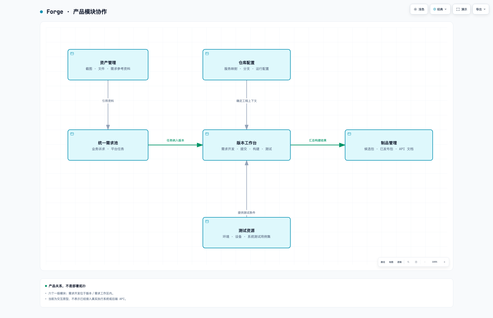
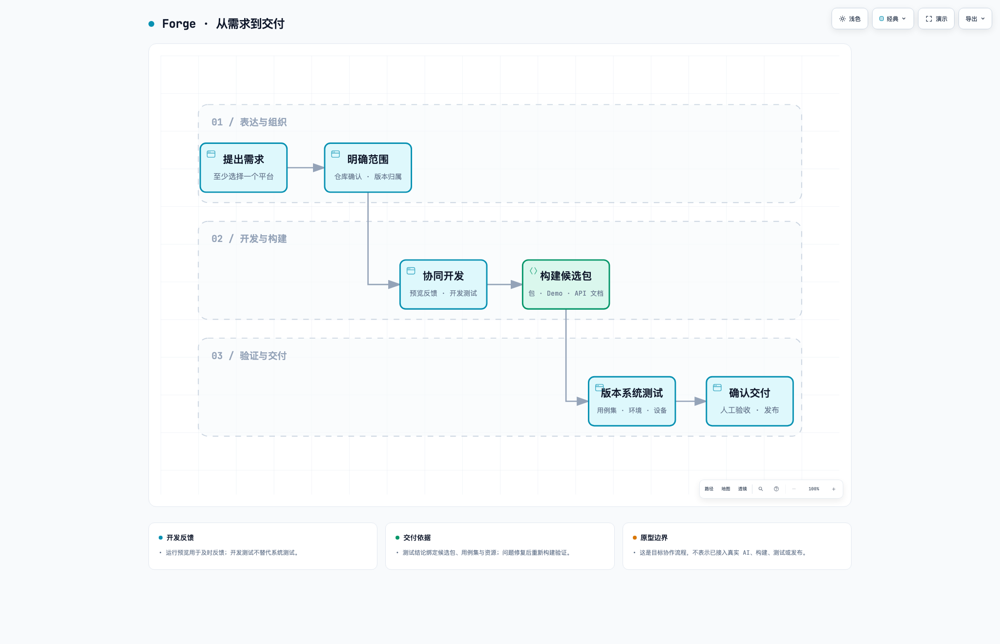

# Forge 产品说明

## 平台目标与产品结构

编写日期：2026-09-22  
原型基线：`6520d16`  
适用对象：产品、业务、研发、测试及平台建设团队

本文基于当前 Forge 原型，说明平台要解决的问题、产品结构和核心业务关系。它是一份产品全貌说明，不是按钮操作手册或技术实现方案。文中的产品目标描述建设方向；当前原型能够真实完成的范围在第八节单独说明。

## 一、产品定位

**Forge 是面向公司内部的 AI 辅助研发交付平台：以需求为协作入口，以平台任务承接开发，以版本组织交付，将代码、运行效果、构建制品、系统测试和参考资料关联起来。**

平台服务于云游戏、SDK、Web 平台和 IaaS 等业务中的研发协作。产品、业务和非研发人员可以表达需求、上传资料、参与讨论并查看开发效果；研发人员维护工程配置、处理代码与跨仓库协作；测试人员组织版本系统测试；相关负责人确认交付结果。

平台不只是一个 AI 聊天框，也不以替代所有现有研发工具为目标。它提供统一的工作入口和业务关联，使用户能围绕同一件需求持续回答：

- 要解决什么问题，涉及哪些平台和仓库？
- 当前开发到什么程度，能否直接看到和操作运行效果？
- 哪些代码修改实现了需求，形成了哪个候选包？
- 这个候选包做过哪些系统测试，结果如何？
- 最终交付了什么，相关文档和参考资料在哪里？

核心目标是缩短“提出需求—理解需求—看到效果—确认交付”的反馈周期，同时保留清晰的变更范围和结果关联。

## 二、平台要达成的目标

| 目标 | 要解决的问题 | 产品上的体现 |
| --- | --- | --- |
| 降低需求表达与参与门槛 | 非研发人员难以准确描述技术实现，也难以参与开发过程 | 自然语言讨论、截图和文件引用、结构化需求说明、可交互运行预览 |
| 减少业务与工程之间的重复转述 | 同一需求跨平台、跨小组后容易出现理解偏差 | 一份业务需求关联多个平台任务；会话共用需求说明，代码修改有明确仓库范围 |
| 提高开发过程的可见性 | 只能等待最终安装包，发现理解错误较晚 | 在需求开发页面查看运行效果；以 Git 提交时间线了解具体修改 |
| 将一次交付组织完整 | 需求、提交、构建、测试与发布分散在不同系统 | 用版本组织任务和候选包，关联系统测试执行与发布记录 |
| 沉淀可复用的配置和资料 | 仓库、分支、设备、用例入口和参考文件反复查找 | 仓库配置、测试资源、制品管理、资产管理提供统一索引 |

这些目标不等同于“AI 自动完成一切”。需求范围调整、跨仓库扩展、业务效果判断和发布决定，仍需要人参与。平台要让 AI 的工作更容易被理解、检查和使用，而不是仅展示更多执行日志。

## 三、面向谁使用

| 使用者 | 主要工作 | 重点入口 |
| --- | --- | --- |
| 产品、业务、解决方案及其他需求提出者 | 提需求、补充场景和资料、查看效果、反馈修改、确认业务结果 | 统一需求池、需求开发、运行预览、资产管理 |
| 研发与代码服务负责人 | 维护代码来源与运行配置、协同 AI 开发、检查提交、确认跨仓库修改范围 | 仓库配置、需求开发、提交记录 |
| 测试人员 | 维护测试资源和用例集关联，选择候选包执行系统测试、查看报告 | 测试资源、版本中的测试页 |
| 版本或交付负责人 | 汇总需求、检查版本进度、查看构建结果与交付物、确认发布 | 版本工作台、制品管理 |

以上是业务职责划分，不表示当前原型已经实现对应的多角色账号和权限系统。

## 四、整体产品结构

平台包含六个一级模块。其中，版本工作台和统一需求池承接日常工作，其余四个模块提供工程配置、测试资源、交付物和知识资料。



图 1：以“需求池 → 版本工作台 → 制品管理”为主线，资产、仓库配置和测试资源提供支撑。箭头表示主要业务关联，不是网络调用或完整依赖清单；图中均为产品模块，不表示后端服务部署，也不包含未经验证的 API。

[打开产品结构交互图](diagrams/product-structure.html)

```text
Forge
├─ 版本工作台
│  ├─ 版本列表与创建版本
│  └─ 版本详情
│     ├─ 概览：交付进度、需求与平台任务
│     ├─ 需求开发：需求说明、会话、涉及仓库、运行预览
│     ├─ 提交记录：按需求查看 Git 提交时间线
│     ├─ 制品管理：当前版本的构建与候选包
│     └─ 测试：用例集绑定、系统测试执行与报告
├─ 统一需求池
│  ├─ 需求列表、Jira 入口、优先级、备注、创建与更新时间
│  ├─ 创建需求与拆分平台任务
│  └─ 需求详情／需求开发
├─ 仓库配置
│  ├─ 产品与代码服务
│  ├─ 业务线、研发小组与仓库映射
│  ├─ 分支与 Tag 命名策略
│  └─ 默认运行配置
├─ 测试资源
│  ├─ 测试环境
│  ├─ 测试设备
│  └─ 测试用例集 → 用例集详情 → MeterSphere 编辑
├─ 制品管理
│  ├─ 全局候选包与已发布包
│  ├─ 构建进度、代码来源、测试与发布关联
│  └─ 下载、在线体验与 API 文档
└─ 资产管理
   ├─ 截图、办公文档、设计文件、PDF、视频、Demo、外部链接
   ├─ 资料预览、下载、说明维护与归档
   └─ 产品／需求归属与需求引用
```

需要特别说明：

- **需求开发不是额外的一级模块**，而是从需求池或版本进入的核心工作页面。
- **版本内制品管理与全局制品管理是同一批交付物的不同视角**，不是两套独立的制品数据。
- **测试执行与测试资源分开**：前者回答“这次测得如何”，后者回答“用什么环境、设备和用例来测”。

## 五、各模块的职责

### 5.1 统一需求池：统一接收和组织业务诉求

统一需求池管理业务需求，而不是要求提出者先理解工程仓库或发布流程。

创建需求时至少选择一个目标平台，并生成对应的平台任务。一个需求可以同时涉及 Android、iOS、Windows、macOS、Web 或服务端；这些任务共享业务目标，但可以有不同的实现和版本归属。

需求列表集中展示标题、Jira 关联入口、优先级、备注、创建／更新时间，以及各平台任务的版本和进度。用户可以进入需求讨论、增加平台任务或调整版本归属。

**需求可以先进入需求池，不必先确定交付版本。选择涉及的仓库，也不应被等同于安排交付版本。** 当前原型中的“开始开发”仍以已归属版本的平台任务为执行上下文，这是执行入口的现状，不代表创建需求必须先排期。

### 5.2 版本工作台：组织一次交付

版本工作台面向交付负责人，将特定产品、业务线、平台下需要一起交付的平台任务组织起来。

一个版本可以承载多个需求的平台任务，也可以产生多次构建。每次构建形成独立的候选包，并关联其代码来源、需求范围和测试记录。

版本详情分为五个页面：

| 页面 | 主要回答的问题 |
| --- | --- |
| 概览 | 本版本包含哪些需求，平台任务进展如何，目前还有什么待办？ |
| 需求开发 | 当前需求如何理解和实现，涉及哪些仓库，运行效果怎样？ |
| 提交记录 | 为这个需求提交了哪些修改，各次提交改变了什么？ |
| 制品管理 | 构建进行到哪一步，候选包是否可下载、体验或查看文档？ |
| 测试 | 本版本绑定哪些用例集，各次系统测试使用什么资源、得到什么结果？ |

当前设计不引入“冻结”或“发布渠道”概念。需求范围调整仍保留修订记录，历史候选包和测试记录不能被直接当作新范围已经验证的证明；这与冻结需求范围是两件事。

### 5.3 需求开发：人和 AI 协作的核心工作区

需求开发将原始需求、补充说明、验收场景、涉及仓库、会话资料和运行效果放在一起，减少在不同系统间往返。

它包含四个主要部分：

1. **需求说明与切换**：查看当前需求，切换其他需求，逐步明确目标、边界和验收标准。
2. **需求会话**：一个需求可有多个会话；会话用于分别讨论问题，但共用需求说明，不产生多份互不相关的需求。
3. **涉及的仓库**：默认展示已配置仓库，允许增加仓库。AI 如果发现当前范围不足，可以提出扩展建议，由用户确认后再纳入，不自动扩大修改范围。
4. **运行预览**：在开发过程中查看并操作应用，支持右侧小窗、新页面和完整桌面视图。

运行预览按“需求＋平台”共享环境，而不是每个会话各启动一套。iOS／Android SDK 对应 Demo 或模拟器体验，Web 对应网页，PC 对应应用窗口。用户和 AI 可随时操作，不设置接管或控制权交接流程。

支持热更新的应用优先热更新；不支持的通过“重新加载”重新编译并启动。收起小窗不停止运行，右侧固定入口可重新展开。**运行预览是开发反馈工具，不是系统测试报告，也不等同于最终交付制品。**

提交记录则以需求为查看范围，按 Git 提交时间线展示修改，每次提交提供约 100–200 字的 AI 摘要。这是对代码变化的说明，不再用大段开发过程步骤替代提交记录；当前摘要和提交数据为演示内容。

### 5.4 仓库配置：维护业务与工程之间的对应关系

仓库配置是 AI 开发和版本交付的基础资料层。它说明“这个业务能力由谁负责、代码在哪里、使用什么分支、如何构建和运行”。

当前业务线包括自建、原力、IaaS、咪咕、云电竞；研发小组包括客户端、引擎、云游戏后台、IaaS 后台。产品下再区分代码服务，例如云游戏 SDK 下的 Android SDK、iOS SDK，云游戏后台下的 cg-session、cg-boss。

这里维护的不是一棵严格的一对一目录，而是多种关联：

- 产品关联多个代码服务，代码服务指定主责小组和协作小组。
- 代码服务在不同业务线下关联具体 Git 仓库、目录和默认分支。
- 不同业务线可以共用一个仓库，但采用不同的分支和 Tag 策略。
- 代码服务配置构建类型、API 文档类型及来源，以及默认开发机、启动命令、热更新方式、应用／桌面预览入口。

例如，原力与自建 Web 共用仓库时，可以分别维护稳定分支、开发分支模板、测试分支、提测 Tag 和发布 Tag。原力的 `yl_main`、`yl_test`、`test_0.0.1.1`、`release_0.0.1.1` 属于该映射的配置，不应成为所有产品的统一硬编码规则。

### 5.5 测试资源：统一管理测试条件和用例入口

测试资源分为三个 Tab：

| 子模块 | 主要维护内容 | 服务于什么工作 |
| --- | --- | --- |
| 测试环境 | 名称、业务线、biz、GID、服务地址、依赖服务／资源池、网络区域、负责人、支持平台、访问账号、AK 标识与 SK 凭据引用 | 明确系统测试使用哪套业务配置和服务环境 |
| 测试设备 | 平台、设备类型、系统／浏览器版本、IP、访问地址、访问账号、启用状态、在线状态和占用情况 | 选择兼容且可用的执行设备 |
| 测试用例集 | 名称、用途说明、MeterSphere 项目用例链接、关联项目、绑定版本和本地示例用例 | 组织本次系统测试的范围，并快速进入外部用例系统 |

版本可以绑定多个系统测试用例集。每次发起系统测试时，再从绑定范围中选择本次执行的用例集，同时选择候选包、测试环境和设备。当前原型的一次执行绑定一个环境和一台设备，执行中占用设备，结束或取消后释放。

用例的查看路径是“用例集列表 → 用例集详情 → MeterSphere 编辑”。本平台维护关联和执行上下文，不重复建设完整的用例编辑器；原型详情中的预置用例是本地只读示例，不是从 MeterSphere 同步的真实数据。

这里要区分两种测试：

- **开发测试**：针对单次开发修改，帮助发现实现中的问题。
- **版本系统测试**：针对选定候选包，按所选用例集验证版本整体行为。

开发测试通过不能代替版本系统测试；一次系统测试的结论也不能脱离候选包、环境、设备和当次用例集范围单独使用。

### 5.6 制品管理：统一查看系统构建的交付物

全局制品管理汇总各产品、业务线、平台和版本的候选包与已发布包。只纳入系统构建的结果，不将用户上传的截图、文档或竞品 Demo 当作制品。

制品记录关联版本、构建批次、代码服务、提交、构建状态、测试记录、API 文档和发布信息。用户既可以在版本内跟进当前交付，也可以从全局检索已有交付物。

构建进度按照类型展示：SDK 通常包含 SDK、Demo、文档构建；后台服务通常包含镜像或二进制构建；Web 则对应应用及相关文档构建。构建完成的部分提供适用的下载、在线体验或 API 文档入口。

API 文档与对应制品关联，在新页面查看。发布是用户明确触发的交付操作，不由“构建结束”自动代表发布完成。

### 5.7 资产管理：保存需求参考资料与研发知识

资产管理承接人提供的研发知识和需求素材，包括截图、办公文件、设计文件、PDF、视频、竞品 Demo、压缩包及外部链接。

资料可以在需求开发过程中上传并关联当前需求，也可以在所属产品范围内被多个需求引用。资产详情提供说明、预览或下载入口、归属范围和关联需求；支持归档与恢复，移除需求引用不等于删除文件。

当前不引入资产版本概念。同名上传也是独立资产，不覆盖旧文件。图片和 PDF 可以在线预览，其他格式以下载或主动打开外部链接为主。

**资产是理解需求的参考材料，不是开发指令。** 上传文档、设计文件或竞品 Demo，不代表用户授权执行其中的命令、运行程序或照单修改所有涉及的系统。

## 六、核心业务关系

| 对象关系 | 产品含义 |
| --- | --- |
| 一个需求 → 多个平台任务 | 业务诉求统一，各平台分别实现；平台任务不是需求的重复副本 |
| 平台任务 → 交付版本 | 当前可暂不归属版本，安排交付时再建立归属；一个版本汇集多个任务 |
| 需求／平台任务 → 一个或多个仓库 | 修改范围由实际工程依赖决定，不与版本选择混为一谈 |
| 产品 → 代码服务 → 业务线下的仓库映射 | 连接业务归属、研发职责与实际代码位置；共享仓库仍可采用不同分支策略 |
| 需求＋平台 → 运行预览环境 | 同一目标在多个会话和窗口间共享运行状态 |
| 版本 → 多次构建 → 候选包 | 多次构建分别保留，不能只用版本号区分所有测试对象 |
| 版本 ↔ 多个系统测试用例集 | 版本定义可选范围，每次执行再确定具体用例集 |
| 系统测试执行 → 候选包＋环境＋设备＋用例集快照 | 测试结论有明确对象；后续配置修改不重写历史执行上下文 |
| 产品／需求 → 参考资产；资产 ↔ 需求引用 | 资料归属与复用关系分开，复用不复制文件，也不扩大所属范围 |

因此，平台的主线可以概括为：**需求说明“为什么做”，仓库配置说明“在哪里做”，平台任务承接“具体怎么实现”，版本说明“这次交付哪些内容”，制品和系统测试说明“交付了什么、验证了什么”。**

## 七、典型使用路径



图 2：从表达与组织，进入开发与构建，再进入验证与交付。开发预览和开发测试用于及时反馈，版本系统测试针对选定候选包进行；发现问题后回到开发并重新构建、验证。本图展示顺向主线，不代表一次通过或无人参与的自动发布。

[打开交付流程交互图](diagrams/delivery-flow.html)（较小桌面需纵向滚动查看完整内容。）

以“游戏启动页增加弱网提示，同时支持 Android 和 iOS”为例：

1. 业务人员在统一需求池创建需求，选择 Android 和 iOS，上传提示样式截图或参考文档。
2. 在需求开发页面与 AI 讨论阈值、提示内容、是否允许继续进入等规则，形成共同的需求说明。
3. 平台展示已配置的仓库。如果还需要后台提供接口，AI 提出新增仓库建议，由用户确认范围。
4. 将平台任务纳入相应交付版本。研发与 AI 在各平台上下文中开发，业务人员通过运行预览检查体验并反馈。
5. 在提交记录中查看修改摘要。完成任务后，在版本内构建 SDK、Demo 和 API 文档，获取候选包。
6. 从版本绑定的用例集中选择本次系统测试范围，指定候选包、环境和设备，查看执行报告并进行人工验收。
7. 根据交付判断明确触发发布。之后仍可从全局制品管理找到包、文档和关联记录，参考资料继续保留在资产管理中。

这是平台希望支持的协作闭环，不表示当前原型已经执行了真实代码开发、编译、远程操作或发布。

## 八、当前原型的能力边界

### 已表达和可交互验证的内容

- 六个一级模块及其主要页面、信息组织方式和跳转关系。
- 创建需求与平台任务、仓库范围选择、版本归属、资源和用例集配置。
- 模拟开发状态、提交摘要、分阶段构建、系统测试记录和发布操作。
- 运行预览的交互、小窗收起展开、新页面共享状态、热更新／重新加载演示。
- 当前页面内的文件上传、资产引用、图片／PDF 预览与下载。

### 不能视为已经完成的系统能力

- 尚未接入真实 AI 开发代理、Git 操作、Jira 工单创建、构建执行器或远程开发机。
- 尚未连接真实测试设备，也未从 MeterSphere 同步或执行真实用例。
- API 文档为示例页面；预置 APK 为不可安装的占位包，在线体验为模拟页面。
- 数据和上传文件主要保存在当前页面内存，刷新恢复初始状态；没有正式的数据持久化、多用户协作或服务端权限控制。
- 访问账号与密钥字段仅表达配置关系，SK 采用凭据引用，不代表已接入密钥管理系统。
- 发布流程和校验仍为演示，不能视为已经具备完整、一致的生产发布门禁、审批或回滚能力。

真正落地时，需要在当前产品结构之下补齐这些执行、存储、安全与系统对接能力，而不是把模拟状态直接替换为“生产可用”的结论。

## 九、总结

Forge 的核心不是把已有工具的页面集中到一起，而是围绕一项业务需求，把表达、实现、反馈和交付组织成连续的协作过程。

六个一级模块各有明确分工：**统一需求池收集诉求，版本工作台组织交付，仓库配置连接工程，测试资源定义验证条件，制品管理沉淀交付结果，资产管理沉淀参考知识。** 需求开发及运行预览是日常协作的核心入口，提交、制品和系统测试则帮助参与者理解并确认交付结果。

### 编写依据

本文以当前原型入口及实际模块实现为准：`ai-dev-pipeline-prototype.html`、`runtime-preview.js`、`runtime-preview-core.js`、`test-suites.js`、`knowledge-assets.js`、`assets-model.js` 与 `README.md`。早期讨论文档仅作为产品背景，不将其阶段性建议视为当前已实现功能或既定实施排期。
