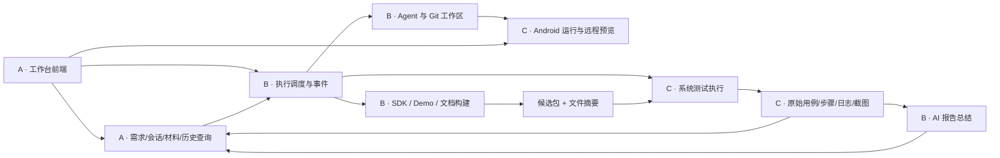

# 需求中心 MVP：三人团队里程碑与职责划分

日期：2026-09-23。范围依据：`ai-dev-pipeline-mvp-v2.html` 当前生效的页面与事件逻辑、`README.md` 的“需求中心 MVP 原型”说明，以及本轮确认的 3 人团队。本文是首期实现建议，不是当前功能已接入的声明。人员技术背景尚未提供，以下 A/B/C 为责任角色。

## 1. 首期交付目标

用户在网页提出一个 Android SDK Demo 需求，与 AI 讨论和修改代码，通过远程运行预览验证交互，确认代码修改后构建候选包，执行选定用例集并查看原始用例步骤与 AI 总结。测试失败后可以继续修改同一需求，产生新的候选包和测试记录。

首期组织单位是需求：一个需求对应一个平台任务。详情保留“概览、需求开发、制品管理、测试”，测试详情保留“测试概览、用例与步骤”。提交、构建、测试执行都是需求下的历史记录，不引入产品版本管理或人工验收状态。

**达到首期目标的判断：**选取 3 个真实、适合 Demo 层修改的需求，从网页创建到真实代码变更、可操作预览、可安装候选包、原始测试报告、AI 总结走通；其中至少一个需求完整演示“测试失败 → 修改 → 新候选包 → 复测”，且旧记录仍可追溯。这里的项目交付检查不是产品内的人工验收步骤。

## 2. 当前原型与待实现能力

| 原型已有交互 | 首期需要完成的真实能力 |
|---|---|
| 需求池、详情、会话、状态展示 | 持久化数据、真实身份、详情路由、按需求隔离的数据访问 |
| 对话后出现修改建议、确认提交 | 接入一种执行 Agent，读取需求与材料、操作工作区、生成实际差异、确认具体差异后提交 |
| 右侧应用/桌面预览、重新加载 | Android 运行环境、画面传输、鼠标/触控输入、共享会话、编译安装启动 |
| SDK/Demo/文档构建状态 | 固定代码提交的真实构建任务、分阶段日志、APK/AAR/文档存储与访问 |
| 用例集、设备、环境选择 | 可执行用例映射、可用运行资源、测试调度与执行快照 |
| 用例步骤与 AI 测试报告 | 原始结果导入、逐步输入/预期/实际、日志/截图、基于结果生成可溯源的 AI 总结 |

当前 HTML 是页面内模拟数据，刷新即重置。多处页面函数存在历史定义与后续覆盖；实现范围应以当前生效交互和本次约定为准，不把旧函数中的提交记录页、人工验收等带回首期。

## 3. 三个人的责任边界

| 角色 | 建议能力背景 | 独立负责的模块 | 交付给其他人的能力 |
|---|---|---|---|
| A：产品全栈 / 工作台负责人 | 前端较强，能实现常规业务 API 与数据模型 | 统一需求池、四个详情页、会话 UI、需求/附件/材料引用存储、制品查询下载、报告展示、页面与业务 API 联调 | 持久化需求与修订、材料引用、各入口的可用界面、历史查询 |
| B：AI 与执行后端负责人 | 后端、异步任务、Git、Agent 接入与构建经验 | Agent 统一调度网关、执行任务生命周期、Agent 适配、工作区/Git、确认差异与提交、构建任务、AI 报告生成 | 可追踪的执行任务、代码提交、固定提交构建、阶段事件、AI 总结 |
| C：Android 与测试工程负责人 | Android 构建运行环境、远程交互、自动化测试开发 | Android 环境与预览传输、运行实例、交互输入、安装启动、用例集/可执行脚本映射、测试执行器、原始报告与证据采集 | 共享运行会话、可操作预览、设备准备接口、真实逐条测试结果 |

A 牵头产品闭环联调，B 牵头跨模块技术契约；每个任务仍只有一个主责人。C 从第一周参加开发，承担工程实现，不只是项目末期做测试。没有单独的项目经理岗位；由用户/产品负责人按里程碑检查场景与范围。

### 容易重叠的职责，提前约定

| 事项 | 主责 | 协作与边界 |
|---|---|---|
| 需求说明与历史修订 | A | B 提交结构化变更；运行中的执行继续使用启动时的修订快照 |
| 执行调度、排队、取消、超时、重试 | B | C 的运行/测试模块执行命令并回报；A 展示状态，前端不推断“任务成功” |
| 工作区、提交及构建输入 | B | C 通过明确的工作区/代码快照标识使用代码，不自行选择最新分支 |
| Android 工具链与构建模板 | B | C 共同维护可运行的 Android 环境；模板维护归 B，设备安装启动归 C |
| 预览生命周期和输入操作 | C | A 负责窗口入口；B 的 Agent 使用同一运行会话能力 |
| 原始测试事实与报告结构 | C | B 的 AI 总结只引用原始事实；A 根据统一结构展示 |
| AI 报告生成 | B | C 定义必须保留的失败/阻塞/跳过与证据引用；AI 生成失败不阻断原始报告查看 |
| 共享数据存储与对象存储 | A | B/C 使用约定接口；各模块拥有自己的写入规则，不跨模块直接改业务字段 |

如果三人都是纯后端，或无人具备 Android/自动化工程经验，不能直接套用此排期。优先补齐 C 的能力或复用已验证的运行/测试服务；增加前端页面人力不能替代运行与测试工程能力。

## 4. 模块与接口

首期建议采用一个工作台前端、模块化业务后端、异步执行 Worker，以及一套 Android 运行资源。模块边界清晰即可，不要求每个能力独立部署成服务。Agent 统一调度网关管理执行上下文、任务与资源调度；执行 Agent 调用模型和工具完成实际开发。

### 最小数据关系

`需求 → 平台任务（1:1）→ 开发执行 → 代码提交 → 构建 → 候选包 → 系统测试执行 → 原始结果 → AI 总结`

另有两条关联：需求下的会话/材料/说明修订；开发执行使用的工作区与运行预览实例。一条需求可以拥有多次执行、提交、构建和系统测试。内部记录 ID、需求修订和文件摘要不等于产品版本管理。

第一周需要共同约定的契约：

| 契约 | 必须明确的信息 | 主责 |
|---|---|---|
| ExecutionSpec | requirementId、taskId、specRevision、会话上下文、材料引用、仓库与代码快照、执行约束 | B，A 提供需求数据 |
| 执行事件 | runId、attemptId、eventId/sequence、阶段、状态、时间、错误、日志/输出引用；断线续读及重复事件处理 | B |
| RuntimeSession | requirementId、workspaceId、runtimeSessionId、应用/桌面入口、共享输入、重载/停止、当前已运行代码标识 | C |
| BuildManifest | buildId、commitSHA、各阶段结果、输出类型/下载地址/文件摘要、日志；构建过程中输入保持不变 | B，A 保存索引 |
| TestRunSpec | artifactId 与摘要、suiteId 与用例快照、环境配置快照、deviceId、触发来源 | C，B 调度 |
| 原始结果与 AI 总结 | 每条用例/步骤的预期/实际/状态/证据，重试记录；AI 结论引用 caseId/stepId/evidenceId | C 定义事实，B 定义生成结果 |

所有资源引用必须能回溯所属需求。历史候选包的测试不能覆盖新候选包的结果，旧提交测试通过也不能使后续修改自动显示“测试通过”。

## 5. 里程碑

排期假设：3 人全职；一人具备 Android/自动化能力；已有可用代码仓库、模型访问、构建机器、模拟器或测试设备；复用一种执行 Agent。以下是约 8–10 周的初排，建议按 10 周安排联调余量；M0 完成后重估，不是交付承诺。

| 里程碑 | 建议时间窗 | 可演示的端到端结果 | 通过标准 |
|---|---|---|---|
| M0：打通关键技术路径 | 第 1 周 | 固定 Demo 能编译安装、网页能操作远程画面、一个脚本用例能执行并回收结果、Agent 能产生可读取的实际代码差异 | 有真实 APK、可操作画面、一条通过和一条失败的步骤结果；确认 MeterSphere 用例与脚本的对应路径；三人接口约定落地 |
| M1：需求成为持久化工作对象 | 第 2 周 | 创建需求 → 自动生成唯一平台任务 → 进入详情 → 补充说明/会话 → 刷新后继续 | 数据持久化；身份及需求关联正确；说明修订和执行记录可追溯；全栈骨架支持执行事件展示 |
| M2：AI 开发与运行预览闭环 | 第 3–5 周 | 输入真实需求 → Agent 修改 → 查看差异 → 预览效果 → 确认差异并形成提交 | 小窗/新页/桌面指向同一运行会话；用户和 AI 可同时输入，无接管流程；Android 重新加载会真实编译安装启动；执行可停止，失败可定位 |
| M3：候选包可使用 | 第 6 周 | 选定提交 → SDK/Demo/文档构建 → 查看分阶段状态 → 下载 APK/AAR、体验 Demo、打开对应文档 | 构建关联固定提交与摘要；安装成功；历史构建保留；失败阶段可定位，重试不覆盖原记录 |
| M4：系统测试与详细报告闭环 | 第 7–8 周 | 选择候选包、用例集、环境和设备 → 系统测试 → 概览 → 用例与步骤 → AI 总结 | 每条用例有实际执行结果；失败/跳过/阻塞分开；步骤证据可查看；AI 总结引用原始结果；重新测试产生新记录 |
| M5：真实需求试用 | 第 9–10 周 | 用 3 个真实需求覆盖正常完成、测试失败后修改、任务中断后恢复 | 完整链路可重复；刷新/断线后记录与状态正确；并行需求不串数据；从一次失败能追溯输入和执行证据 |

M2 是“能用于开发”的节点；M4 是首个具备候选包与测试报告的业务闭环；M5 是适合稳定交给内部用户试用的节点。每个里程碑都直接演示页面到真实执行结果。

### 每阶段三个人如何并行

| 阶段 | A：产品全栈 | B：AI/执行后端 | C：Android/测试 |
|---|---|---|---|
| M0 | 业务对象、接口样例、页面范围确认 | Agent/仓库/构建验证、执行契约 | 远程预览、设备、脚本与结果验证 |
| M1 | 需求/会话存储、业务 API 与页面 | 执行任务和事件骨架 | 运行服务及测试适配器骨架 |
| M2 | 对话、差异确认、预览嵌入与事件状态 | Agent 工具、执行快照、工作区与提交 | 共享运行会话、输入、安装启动、重载 |
| M3 | 制品查询、下载与文档入口 | 构建流水线、输出清单、重试 | 安装验证，同时推进真实用例脚本 |
| M4 | 配置选择、测试概览和用例步骤页 | 调度对接、AI 报告生成 | 测试执行、MeterSphere 关联、原始结果 |
| M5 | 全流程体验及历史恢复 | 任务恢复、取消与诊断 | 失败/并行场景、设备稳定性、试用结果 |

关键依赖：M0 的“可编译、可预览、可执行用例”决定可行性；M2 的确定代码输入决定 M3；M3 的确定候选包决定 M4。测试脚本与报告结构在 M0/M1 即可并行推进，无需等待正式候选包。

## 6. 首期必须说清楚的规则

1. **开发验证与系统测试分别记录。** Agent 改代码时运行的检查归开发执行；系统测试针对明确的候选包和用例集。运行预览是开发环境，也不是系统测试报告。
2. **用例管理与可执行测试之间有适配工作。** 先盘点现有用例中哪些有脚本、断言和测试数据。建议首期选择约 8–12 条覆盖核心场景的用例，每条明确关联执行器；不可执行项标记阻塞/未执行，不能自动记为通过。实际用例数量在 M0 按现成资产调整。
3. **MeterSphere 关联先闭合最小路径。** 本平台选择已配置用例集，保存执行时快照并提供项目跳转；C 验证当前实例是否能取得需要的用例/步骤与结果写回能力。若尚无可用接口，先采用明确的导入映射并标明来源，真实测试结果仍可由执行器回收。全量双向同步另排，不让它阻塞真实测试闭环。
4. **预览窗口共享同一运行实例。** 新窗口不是重新启动一台设备。人和 AI 使用同一操作入口，不设计接管/交换模式。输入按到达顺序处理并保留事件，用户能看到当前操作效果。
5. **预览和系统测试隔离。** 系统测试使用独立实例或明确的排队资源，防止人在预览里的点击影响测试结果；实例租约与排队由 B 统一调度，C 执行。
6. **运行中输入有固定快照。** 新消息形成后续修订或后续执行，不隐式改变已经开始的构建与测试。新代码确认提交时校验所确认的差异没有过期。
7. **报告先有原始结果，再有 AI 总结。** 保留最初失败与重试结果；不能把“重试后通过”压成“从未失败”。AI 失败时原始报告仍能访问；截图、录屏未采集时展示缺失状态。首期优先做日志和失败截图，真实录屏按现有采集能力决定。
8. **移除业务版本概念不影响追溯。** 保留提交 SHA、需求修订、buildId、artifactId、runId 与文件摘要；不再要求版本号、冻结或发布渠道。

## 7. 聚焦范围与排期风险

首期配置可由部署配置/种子数据提供：一个 Android Demo 代码服务、一个默认仓库映射、一个工具链模板、少量开发/测试设备、几个可执行用例集。需要用户选择的内容在任务入口展示，不新增全局仓库/资产/设备管理产品页。

需求材料支持截图、文件、链接的上传与关联；优先让 Agent 消费文字和截图，其他文件保留下载与补充说明。不承诺首期能自动理解任意办公文件、设计源文件或运行竞品 Demo。全局资产库与已有资产搜索复用后排，原型中的引用入口不能成为首期隐藏的完整资产平台依赖。

不纳入本次首期：多平台调度、版本工作台、人工验收、发布/冻结/渠道、单独提交记录页面、全局制品/资产/测试资源管理、Jira 深度同步、MeterSphere 用例在线编辑、大规模设备池调度。真实身份和必要的资源访问控制复用现有方案即可。

| 风险 | 影响 | 在何时消除 |
|---|---|---|
| 三个人缺少对应技术背景 | 分工名义成立，实际能力无人完成 | M0 由实际人员对 A/B/C 认领，及时调整范围或复用服务 |
| 没有稳定 Android 工具链/预览链路 | M2/M3 均不可交付 | 第一周完成真机/模拟器、画面和输入验证 |
| 用例只有文字，无脚本或可靠断言 | 测试页无法产生真实逐步骤结果 | 第一周列出可执行用例清单、执行器与缺口 |
| AI 能回复但不能稳定执行/恢复 | 页面看似联通，真实开发失败不可追溯 | M0 验证实际差异；M2 验证停止、错误和确认提交 |
| C 同时承担预览和测试，负荷最大 | 后期成为瓶颈 | M0 验证两条路径；M1 起并行积累测试脚本；B 承担公共执行骨架 |
| A 承担所有界面，末期才联调 | 后端进度不能转化为可用产品 | 每周按一条真实用户路径集成；B/C 持续提供契约样例与真实事件 |

下一步可直接将 `tasks/todo.md` 的 A/B/C 替换为三位同事姓名。正式日期以 M0 的验证结果和实际人员投入重排。
